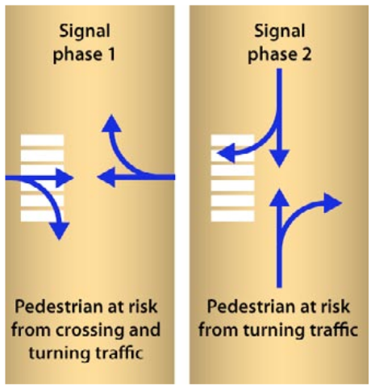
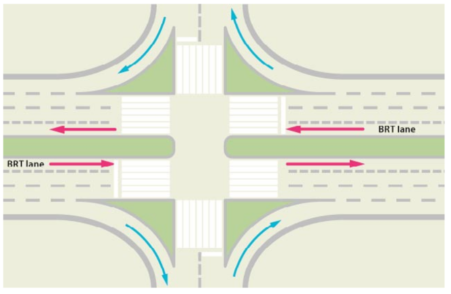
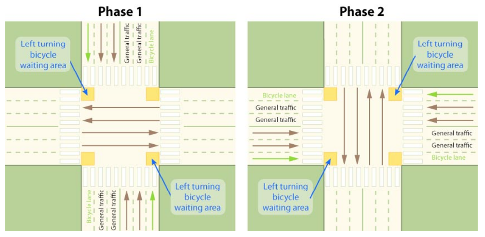

#[Intersections and traffic signals](toc.md#toc)

## Integrating pedestrian and cyclist movements

**"The way I see it, I can either cross the street, or I can keep waiting for another few years of green lights to go by.”** - Camryn Manheim, actress, 1961 -

A highly efficient intersection for mixed traffic and BRT vehicles may not be user-friendly to other street users, especially vulnerable users such as pedestrians and cyclists.  Further, the entire viability of the BRT system can be undermined if the surrounding pedestrian environment is not amenable to attracting customers to the BRT station.  This section examines design options that not only are conducive to effective vehicle movements at intersections but also options that successfully accommodate pedestrian and cyclist movements.

A standard two-phase traffic signal configuration does not offer any exclusive movements for pedestrians (figure \fignum(two-phase-zebra)). The pedestrian is blocked by crossing or turning traffic in either phase. In such circumstances, the pedestrian must seek a discernible break in the traffic and make a quick crossing. Such conditions may put pedestrians at considerable risk.

The lack of safe pedestrian options can also be the case for three and four phase intersections, depending on the configuration. If intersections are designed to slow turning vehicles and if turning vehicle volumes are not that high, the problem may not be serious, and is eventually better for pedestrians, that do not have to wait a whole cycle to cross.  However, if turning volumes are high or intersections allow high speed kerb-side turns, bicyclists and pedestrians going straight will have problems crossing the road.

The normal solution to this problem is the creation of a pedestrian refuge island between the kerb-side turn slip lane and the intersection and not allowing kerb-side turns during the red signal phase (figure \fignum(refuge-island)).  Pedestrians can generally cross to this pedestrian refuge island during the red phase, and then cross when the light turns green. Another possible solution for this is a short “leading pedestrian interval” that allows pedestrians to cross in front of kerb-side turning vehicles prior to the change of the signal to green.  This option still requires disallowing kerb-side turns on the red signal but mitigates the need for the pedestrian refuge island.  More discussion on safe pedestrian access is included in Chapters 29 and 31 (Pedestrian integration and Bicycle and pedcab Integration).

 

For cyclists, intersection risks often emanate from turning vehicles that threaten straight movements by the cyclists.  Since the motorised vehicles are often travelling much faster than the bicycles, there is a great potential for conflict and risk at turning locations.  Cyclists may feel particularly vulnerable when wanting to turn cross-traffic.  

There, are at least two mechanisms for permitting cyclists to safely navigate intersections:

- Infrastructure giving physical priority to cyclists and allowing them to cross prior to private vehicles; and/or,
- Dedicated signalisation for cyclists.

In several countries, dedicated areas located in front of the stopping line for motorised vehicles have been an effective option (figures \fignum(xian-cyclists) and \fignum(uk-bike)). The idea is to give cyclists a head start over motorised vehicles in crossing the intersection.  The cyclists are given a designated box to wait for the green signal phase. In some cases, this physical priority can be combined with a advanced green signal phase as well.

 cyclists are given designated waiting areas from which they have priority access to crossing the street. Photo by Karl Fjellstrom.")

, a priority bicycle stopping area is placed ahead of the stopping line for motorised vehicles. Photo by Lloyd Wright.")

A schematic of the bicycle priority measures utilised in Xi’an is given in figure \fignum(xian-bike-movements) for each of the two signal phases.

