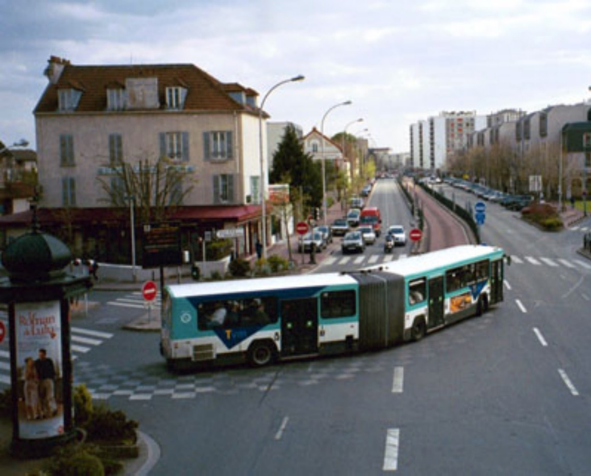
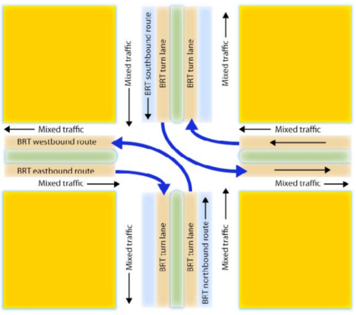
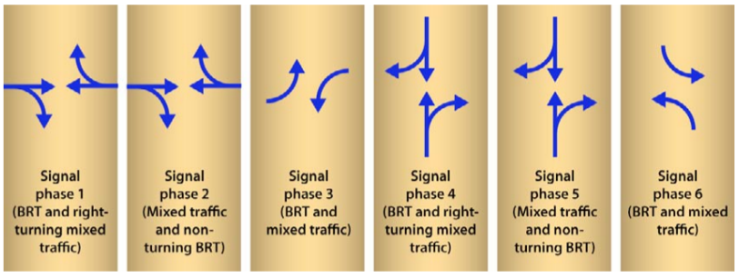
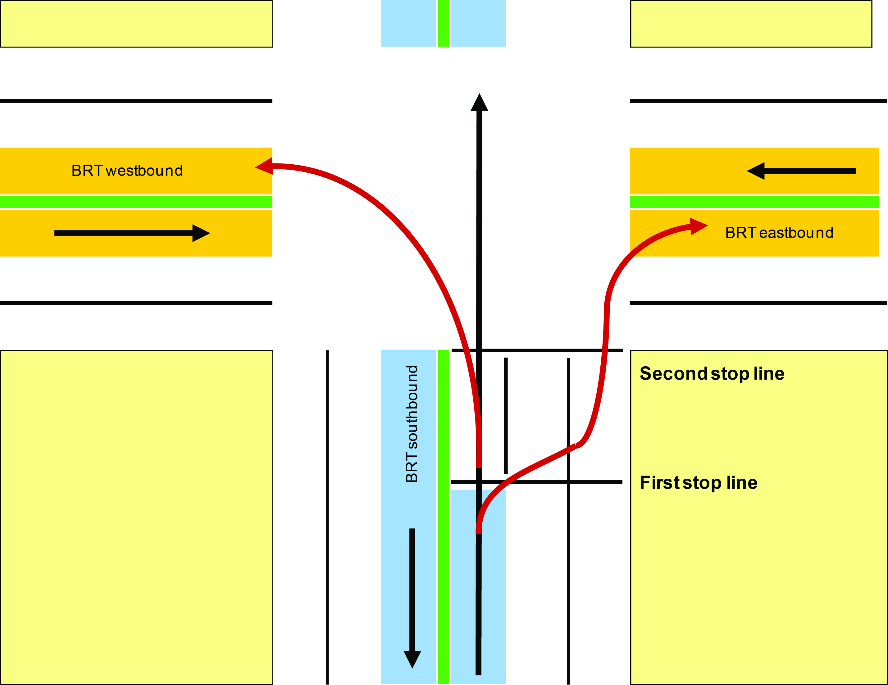
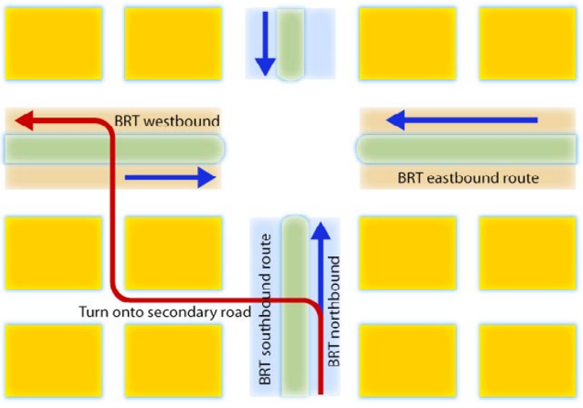
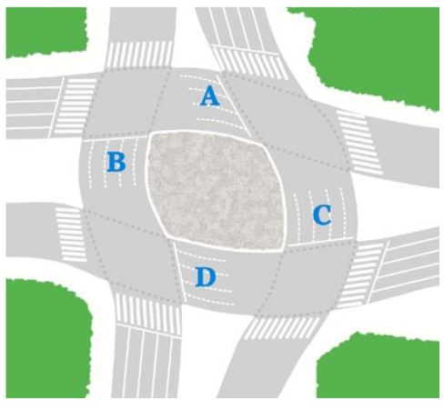
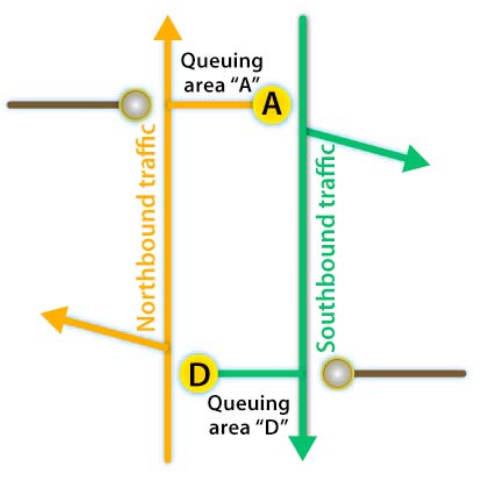

# [Intersections and traffic signals](toc.md#toc)

## Allowing BRT turns

**"An Englishman, even if he is alone, forms an orderly queue of one."** - George Mikes, writer, 1912 - 1987

While service plan simplification and organization may to an extent minimize turning movements for BRT vehicles in the busway, by placing them in the same intersections, turning is necessary and desired where it best serves the demand (in opposition to allowing it where it is convenient by geometry). By planning BRT routes that change between corridors (i.e., with turns), easy platform transfers for the customers are made possible and ideally not even necessary for most users. Thus, turning movements by BRT vehicles shall be an integral part of designing an effective overall route structure. As the BRT system expands and provides an increasingly dense network of lines, the connections between these lines become more complex. As BRT systems grow, there will be a growing number of BRT trunk corridors that cross one another.

The costs of not allowing turning movements by BRT vehicles are quite evident, especially in terms of customer convenience. Quito’s three BRT corridors (Trolé, Ecovía, Metrobus-Q) all operate as independent corridors, despite each intersecting one another at several points in the city. At one of the critical intersections between two intersecting BRT corridors in Bogotá (Caracas and Jimenez), customers must transfer by negotiating passages through stairs and an underground tunnel (Figures \fignum(bogota-walking-tunnel) and \fignum(bogota-stairs)). In both these examples, allowing turning movements by the BRT vehicles could have permitted simpler and more convenient platform transfers for the customer. Furthermore, constructing connecting pedestrian tunnels can add much to the overall infrastructure costs of the system. This is copying the bad parts of rail systems. In the Bogotá situation, customer convenience has been significantly increased by allowing turn movements and direct transfers between the Caracas and Jimenez corridors. 

[bogota-walking-tunnel](img/bogota-walking-tunnel "A tunnel is used to connect two intersecting corridors in Bogotá. Even connection is good, walking times could be prevented if routes shift from one corridor to another.Photo by Lloyd Wright.")

[bogota-stairs](img/bogota-stairs.jpg "Separated-grade walking connections provide safety and limited convenience. Walking transfers provide physical hardship". Photo by Lloyd Wright;")

There are several solutions to allow BRT vehicles turning that avoid consuming much of intersection capacity – mostly needed for cars in that intersection – and the appropriate solutions will depend on the budget available, right-of-way available, the number of vehicles in the BRT system and their turning volumes, and the level of mixed traffic and its turning volumes. The optimal solution will be location specific and it is recommended that each intersection be evaluated and optimized separately. We present common options for busway turning movements:
1. Dedicated turning lanes and additional signal phases for BRT vehicles;
2. BRT vehicles operating in mixed traffic turning lanes;
3. BRT turning movements prior to the intersection;
4. Transform the crossing in a roundabout.
5. Grade separation 

### Dedicated Turning Lanes and Additional Signal Phases for BRT vehicles

A dedicated turning lane for BRT vehicles has the advantage of keeping the BRT vehicles in a controlled space at all times. (figure \fignum(paris-brt-turn). This arrangement may require an additional signal phase if there was no previous cross-traffic-turn phase. Otherwise, the dedicated turn would take place at the same time that the mixed traffic is allowed to turn left.

Possibly the greatest challenge to this configuration is finding the physical space to place the additional turning lane. The roadway would likely have to accommodate at least five lanes (figure \fignum(brt-turning-signal-phases). If two lanes of mixed traffic in each direction are to be maintained for straight-car movements, then seven lanes of road space would be required.

, a three-phase traffic signal would be required. Diagram courtesy of ITDP.")

The configuration suggested in figure \fignum(topview-brt-turn-three-phases) would require a three-phase traffic signal, as indicated in figure \fignum(brt-turning-three-signal-phases) that, in case of median-station configuration, can provide full access to all route permutations without walking: a southbound vehicle turning east will give passengers access to westbound routes via platform transfer at the first station. In designing this option, one would choose the highest demand routes to receive the transfer-free routing.

In this scenario, one could technically also allow cross-traffic-turn movements for mixed-traffic vehicles for traffic  from north and south , but even more additional lanes would  be required. Ideally though, mixed traffic should be diverted as proposed in the section above (\sectionnumname(Restrictions to mixed-traffic turn-movement)) as the BRT cross-traffic turn phase will be usually very short (like the queue-jumping phase, \sectionnum(queue-jumping)).

If the turning BRT vehicle frequencies are low enough, the BRT only short phase can accommodate both right and left turns from one direction as BRT vehicle's drivers can negotiate entrance in the other corridor. That would avoid the need of two waiting lanes for turns.

The complexity of dedicated turning lanes obviously increases as turning options for both BRT vehicles and mixed-traffic vehicles increase. In the extreme of permitting all BRT turning options and all mixed-traffic turning options, then a total of six traffic-signal phases would be required (figure \fignum(brt-turn-six-phases-negotiated)).This number of phases clearly holds disadvantages in terms of waiting times for both BRT and mixed traffic-movements and reduces capacity of the intersection so drastically -- besides requiring 4 lanes 4 BRT and likely 6 to mixed traffic -- that is very likely to be unfeasible in a location where two important corridors cross each other.

<!--> Move around in this Jakarta intersection of 2 corridors with Google Street View:
(https://www.google.com.br/maps/@-6.167649,106.821039,3a,75y,6.35h,84.17t/data=!3m6!1e1!3m4!1s1FyI5G400U8kbl18-AolUw!2e0!7i13312!8i6656!6m1!1e1)

(if link is broken: Jalan Majaphit X Jalan Veteran in Jakarta DKI) <\!-->

### BRT Vehicles Operating in Mixed-traffic Turning Lanes

In this scenario, all turning BRT vehicles must leave the dedicated busway and enter mixed-traffic lanes.  Thus, a cross-traffic-turning BRT vehicle will leave the busway and directly enter the cross-traffic-turn lane for cars. A kerb-side-turning BRT vehicle must leave the median-side busway and merge to the kerb-side of the street to, after the turn, they re-enter the median-side busway on the new corridor.

This technique is the most common solution that has been used in many of the “open” BRT systems like in Kunming, China, and is being planned on several “direct services” BRT systems (figure \fignum(kunming-turn). If there is no physical separation of the busway, the merge with the mixed traffic can happen anywhere in the proceeding block.  If there is physical separation, it must occur at the previous intersection, or a slip lane must be provided. 

From a signal phase standpoint, this option is the easiest to implement, as it does not require changing the signal phase, and does not require any major new infrastructure. However, this option does present serious disadvantages in terms of congestion delay for the turning BRT vehicles, not to mention the assumed inefficiency of four-stages to mixed traffic. Further, if the mixed-traffic congestion is heavy, the BRT vehicles attempting to turn may not be able to readily leave the busway, and thus can cause delays to all BRT vehicles, even those vehicles continuing in a straight routing.  The BRT vehicle turning right has particular challenges since it must essentially cross all mixed-traffic lanes both before and after the intersection.  Attempting these lane changes is particularly difficult if the system is using 18.5-metre articulated vehicles or 24-metre bi-articulated vehicles.

Any time BRT vehicles must leave exclusive busway operation and enter mixed-traffic lanes the system losses a certain amount of psychological status with the customer.  Mixed-traffic operation makes the system much more akin to a conventional bus system rather than a highly-efficient mass transit system.  

#### Queue-jump Signalization for BRT vehicles (Pre-signals)

Signal system can be utilized to give BRT vehicles a head start on turning movements prior to private-vehicle turning movements. In this case, a dual traffic signal is utilized for each direction of travel. One traffic signal is located at the intersection, and another traffic signal is located approximately 30 to 50  meters prior to the intersection. At the traffic signal prior to the intersection, the BRT vehicles on the busway would receive a green signal of approximately  10 seconds prior to the green signal for the mixed traffic (Figure \fignum(queue-jump)). During this head start, the BRT vehicle would be able to exit the busway and cross to the other side of the street. This is equivalent of having eight-stages and besides the same problems with congestion in mixed-traffic, a BRT vehicle that arrives in the middle of the green phase will be blocked by cross-traffic turning cars and block eventual vehicles behind it. Figure \fignum(cape-town-pre-signal) shows an example of pre-signal without brt-turning; it is used as a way to allow mixed-traffic turn cross-traffic under constrained width

### BRT Turning Movements Prior to the Intersection

To avoid having an special BRT turning phase in an main intersection, an alternative is to create a special bus-only turn (this is as good for left as to right turns) phase at an intersection before a major intersection where there is less crossing demand than in the main crossing corridor, or no demand at all (figure \fignum(turn-on-secondary-street)).  For a few blocks, the BRT vehicle will operate on secondary streets (in mixed traffic or on a dedicated lane) until it rejoins the busway.  This option requires the availability of usable secondary streets and consideration regarding the placement and use of stations by turning routes (not to move it too far from origin/destiny of many trips on the other side of the main intersection).

### Convert cross into a roundabout

If the crossing corridors happens to be of two broad highways, enough right-of-way may be available to convert a standard four phase intersection into a two-phase signalized roundabout. This is a clever alternative that shall be remembered, as as in many developing-nation cities, such right-of-way is available but underutilised. 
The exclusive BRT busway terminates approximately 50 metres prior to the intersection with the BRT vehicles entering mixed traffic at that point.  This approach essentially turns the junction into a grid of one-way streets. It requires a fairly large amount of right-of-way at the junction.  
Figure \fignum(into-roundabout) indicates how the junction between two major boulevards can be turned into a two-phase traffic circle by creating a kind of mini-grid of one-way streets.  At low traffic volumes, the BRT buses enter mixed traffic prior to the intersection.  A series of queuing areas (marked as “A”, “B”, “C”, and “D” in the figure) help stage vehicle flows through the roundabout. This areas are referred as “waiting boxes”

Figure \fignum(into-roundabout-west-east) outlines the vehicle movements for first signal phase for this roundabout conversion.  This example is given from the perspective of a British-style road configuration.  All east-bound BRT vehicles and mixed traffic vehicles that are making right-hand turns would pass through the intersection and queue in area “C” at a traffic light.  All east- and west-bound traffic can proceed straight.  All vehicles making left-hand turns can proceed.  All west-bound traffic would pass through the intersection and queue in area “B”.

In the second signal phase, all northbound and southbound traffic can proceed straight, all left hand turns can proceed, and all right turning traffic would queue in areas “A” and “D” (Figure \fignum(into-roundabout-north-south). 

.

.

This solution will work up to the point where the amount of space in areas “A”, “B”, “C”, and “D” is sufficient to accommodate all the turning traffic. The required and available space are discussed in Box 24.1. 

Opposite to the rule to increase capacity, cycle on a signalised roundabout of this type should be short, so the queueing box can handle volumes (manual operators must be very careful when handling these intersections, keeping eye in the queueing boxes to decide when to alternate to the next phase). Other alternatives of busways through roundabouts are discussed in the next section.

#### Required and available space for queueing boxes:

For the purpose of evaluating queueing space, we consider that:
- The amount of road space a passenger-car practically uses is 15 square meters, this includes some distance kept vehicles keep from each other when queueing on the traffic light (Area_pcu = 15 m^2);
- The amount of road space needed for a 12 metre-bus to queue is 30 square meters, there fore its equivalence factor is 2.0, i.e. one 12 metre-bus uses twice the space a pcu;
- An articulated BRT vehicle has an equivalent factor of 3.5 pcu;

The available area capacity and the required area (or demanded area) to transform a cross into a round about are:

where:
AvailableCapacity: number of cars that fit in wait-box (in pcu)
Area_wait-box: amount of space in the wait box (either A, B, C or D in Figure \fignum(into-roundabout))
Area_pcu: amount of road space a passenger-car uses = 15 m^2 (it should be expressed in the same unit of area_wait-box, obviously)

where:
RequiredCapacity_wait-box: number of cars that need to fit in wait-box (in the same unit the numerator of the measure described bellow, normally pcu)
Flow_left-turn: Number of vehicles that turn left during the peak (normally expressed in pcu/hour, see basic concepts of this chapter)
Time_cycle: time duration of a complete traffic light cycle during the peak (normally expressed in seconds, so here need to be converted the same unit of the flow above, dividing the value by 3.600)

In order for the configuration to function, the available space capacity must be equal or greater than the required capacity.

###### Example

The following scenario provides an example of calculating the required and available capacity of the proposed roundabout queuing space:
- Turning movement = 540 pcu/hour = 0.15 pcu/sec
- Cycle time = 90 sec
**Required capacity = 0.15 * 90 = 13.5 pcu**

- Unitary pcu space = 3 m * 5 m = 15 m2
- Length = 30 m
- Width = 12 m
**Available capacity = (30 m * 12 m) / (15 m2/pcu) = 24 pcu**

In this case, the available capacity is greater than the required capacity (24 pcu ≥ 13.5 pcu), so the proposed roundabout conversion could function.

Considering the figure  \fignum(into-roundabout),  when the number of mixed traffic vehicles and BRT vehicles rises to the point that areas “A”, “B”, “C”, and “D” are too small to accommodate them all, turns should be restricted for mixed traffic but not for BRT vehicles. Effectively, the queuing areas “A”, “B”, “C”, and “D” would be reserved for BRT vehicles. 

