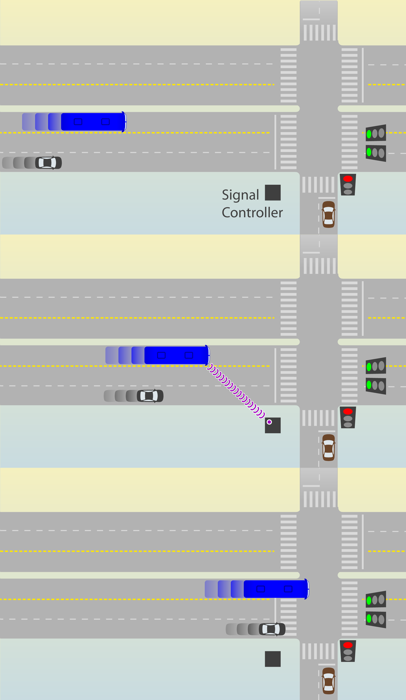

#[Intersections and traffic signals](toc.md#toc)

## Basic Concepts

The basic concepts we present here are mostly related to understanding the equations related to delay and queues sizes in signalized intersections, without intention to be a complete reference about it. For basic concepts the reader may want to further investigate the concepts of traffic density and traffic headway, and how they relate with traffic average speed and traffic flow. We provide further references for traffic signals in the bibliography.

Before that, we emphasize that when applying formulas, attention should be given to units and units conversions, as the appropriate dimension to perceive phase times in traffic lights or the time to walk or ride a few blocks is seconds while we better perceive speeds in kilometres or miles per hour. It is useful to remember that 1 hour is the same as 3600 seconds and one mile is approximately 1.6 kilometres and 1 kilometre is approximately 0.6 miles.

### General concepts

###### cross-traffic-turn and kerb-side-turn

For this chapter we have excluded the expressions right-turn and left-turn as they have different meanings in different hand-way systems. We have chosen to adopt cross-traffic and kerb-side-turn instead.

*cross-traffic-turn*: a vehicle movement to exit the current traffic stream direction that requires crossing the flow in the opposite way. If a busway or a bike lane is present near the medium, there is also conflict the BRT vehicles or bicycles going straight in the same way as in opposite way.

*kerb-side-turn*: a vehicle movement to exit the current traffic stream direction that normally does not cross any vehicle flow. This movement conflicts with people on the side walk in both ways and if the road abridges curb-side busway or a curbside bike-lane, there is conflict with that traffic as well.

*u-turn* (this is the usual concept, included here only for completeness, as this is not always obvious for non-native speakers): a vehicle movement to join  the traffic stream in the opposite way of the direction it is current flow. Depending on the width of the medium this movement can be less conflicting than the cross-traffic-turn or more conflicting as the speed has to be lower. This movement is sometimes moved away from the intersection where other movements are allowed, creating another intersection exclusively for it. Due to road geometry restriction or other considerations, this movement eventually is channelized to start from a waiting area from the curb-side of the road, in which case it will conflict with both flows in the same way a cross-traffic-turn from a perpendicular street would.

, kerb-side-turn\(blue car\), u-turn without space \(red car\), u-turn with space \(pink car\) for right driving way as in China, US, Brazil and Continental Europe")
, kerb-side-turn\(blue car\), u-turn without space \(red car\), u-turn with space \(pink car\) for left driving way as in India, Indonesia, South-Africa, Tanzania, Australia and UK")

###### Speed

For application with the concepts outlined in this chapter, speed, to which we use the letter V from the synonymous velocity, is the average traffic speed of all vehicles in a segment. It would be measured by the mean time all vehicles crossing the segment divided by the segment extension. Under our modelling intents (that is capacity evaluation) it can be imagined that all vehicles are moving in that speed.

Still matching the broader concept of speed -- the ratio of motion expressed in distance per unit of time -- it is useful to remember that given a segment length (D_segment, for distance), knowing the speed (V_segment) is equivalent of knowing the travel time (Time_segment) through the segment and vice-versa, as the equivalent equations show:

 

###### Delay

Delay is the additional travel time, if not explicit, the base reference is the travel time without any conflicts, in an ideal situation where the passenger, pedestrian or driver is the only user of the road (no other drivers, pedestrians users or traffic lights).

###### pcu

A passenger-car unit, or pcu is a reference used to bring different vehicle types to a common denominator. The conversion factor from a certain type of vehicle to a passenger car unit depends of application intended after the conversion, being eventually calibrated for an specific use in an specific situation (for example if stress upon the pavement or congestion potential is considered, if such is in urban environment or in a highway, in a ramp or in plain terrain).

In any case, a motorcycle for example tends to have an equivalent of less than one vehicle, and a mini-bus is equivalent to more than one vehicle, the larger and heavier the vehicle, higher the equivalence is.

###### Flow 

Traffic engineering borrow concepts from fluid mechanics and uses "flow rate" as a measure traffic intensity.
From that definition, the word "rate" is commonly dropped and "flow" alone becomes treated as physical quantity expressed by the number of vehicles crossing a transversal section (or cross-section, like a stop line) during a certain time interval. Flow is usually represented by letter q in equations, but we will avoid that here and use the full word instead.

It should be noted the use the word "volume" to express the same idea is accepted even it is conceptually even more far from the original definition (fluid mechanics original comparative term would be "volume flow rate" even "mass flow rate" is more appropriated reference as the same number of vehicles can be compressed); volume should refer to total number of vehicles in the same way litres refers to volume and litres/second refers to flow in hydraulics. The term is specially common in the expression "volume/capacity ratio", which makes particular sense.

 

Flow can also be expressed for pedestrians, bicycles or even passengers

###### Capacity and Saturation  

The capacity (flow rate) of a segment is given by the lower capacity of a section within it, the term "bottleneck" for the lower-capacity-section express this concept quite clearly.

The capacity of a section by its turn is defined as the maximum flow a section can handle under prevailing use. It is subject to the number of lanes, width of lanes, ramp inclination, the use of surrounding areas --  as parking and stopping regulations, presence of intersection or traffic light ahead, bus stops existence and frequencies and  cultural driving behaviours.

Capacity can be easily and objectively measured, but some of the influential factors cannot. Many models have been developed to improve forecast of road capacity based on the knowledge of design and use of surrounds and even the more detailed simulators needs careful calibration to correctly represent driver behaviours changes, that tend to be unique to each place.

The simpler models commonly don't fit exactly to theories either and are usually adjusted by experimental evidence. These resort to the concept of **basic saturation flow**.

Basic saturation (flow rate) is the capacity for a section of a given standard ideal carriageway, divided by number of lanes of that given standard carriage way, it is commonly expressed by "s0"
Capacity and speed are inter-dependent and the maximum flow does not happens when speeds are maximum. This happens due to the fact that the distance a driver maintains from the vehicle in front of it raises more than proportionally than the speed increase. The speed maximum capacity occurs in a section of unconstrained road is between 60 and 80 kph (km/hour).  
Based on extensive observations, capacity models then define a way to forecast a **saturation flow** multiplying the basic saturation flow by adjustment factors to account for various non-ideal geometric, traffic, and environmental conditions of a given section, such as number of lanes, lane width, heavy vehicles, grade, parking facilities, bus blockage, area type, turning traffic along the segment, radius of turnings, pedestrian crossing traffic, but not considering traffic lights.

Saturation is commonly written as S in equations, but here we use "SaturationFlow" or "SatFlow" to avoid confusion with demand saturation level, usually "X" that represents the relation between demand and capacity for a given infrastructure element as an intersection or a station.

 ")

Saturation (flow rate), therefore, is the capacity of a section that is **not** under the influence of traffic light; for section that approach the traffic light, saturation is the capacity assuming a constant green, which would equal to the flow observed during the queueing discharge. For this reason saturation maybe called discharge (flow rate). When working in an specific location, saturation of sections can be measured, so the resulting product of all this factors is known.

A practical rule, even distorting a bit the concept of ideal conditions is that: for urban environments, the observed saturation of a lane is 1800 pcu/hour. For the purpose of capacity measuring an 18-metres-articulated bus is equivalent to 2.5 car-passengers-unit. So in a busway, the saturation per lane is 720 articulated-bus/hour.

 

###### Continuity

Although no direct formula application about continuity is used in this chapter, one basic equation of an intersection is that all the flow into the intersection has to exit the intersection.

### Traffic signal concepts

Traffic lights are a very common intersection management tool in business district areas where the BRT corridor design is likely to face the more challenging problems. Traffic lights controllers can be coordinated and actuated (use detection) by more or less complex technology and algorithms, a lot of research and development have been made in the last 30 years, but its use is relatively limited. The concepts presented in this chapter are useful to understand BRT design requirements to program traffic lights, be it on simpler controllers or as policy delimiters to more complex systems.

Traffic lights eliminate some of the negotiations between vehicles on arrival, by determining which movements may proceed at a given moment. Traffic lights may allow conflicting movements, usually not all of them intense; pedestrian crossing the transversal street is commonly one of them. By reducing negotiations, traffic light prevents that all vehicles approaching the intersection reduce their speeds, and the time each vehicle spends on the intersection itself and increasing the throughput and safety.

###### Phase

One set of movements that are allowed to occur at the same time is called a signal phase. It should be noted that some movements are allowed during several phases;in many countries, allowing o-turns at all times is the standard. Some writers, ourselves eventually included, may use expressions like "allowing a particular turn in the beginning of  phase two" when technically it should be "adding a short phase before phase 2 where particular turn will be allowed". 

###### Effective green time (T_green)

The phase duration (or length) refers to its "effective green" time, which is the time vehicles doing the movement considered are effectively moving, which may start a little after the green light is given and end in the middle of yellow lights (where such is used), or in the first moments of red (clearance interval). For this chapter, where queueing and intersection capacity is evaluated, green time means "effective green" time.

###### Cycle time (T_cycle)

Excluding situations where special phases are activated by detectors, the traffic signals on an intersection repeats the order of the phases successively in cycles. The cycle time can be measured as the time between the green light is given to a movement till the next time it is given to that movement again (after it has changed to red once). In this chapter, "cycle time" alone refers to a traffic light cycle time (route cycle times are not discussed). ###### Red time (T_red)

###### Red time (T_red)

For the interest of intersection capacity and queueing evaluation, red time means cycle time minus (effective) green time

###### Lost time

Lost time is the period between the end of the effective green of a phase and the start of the next. Lost times depends both of the signal programming for yellow times and overlapping red (clearance red), enforcement policy, and driver behaviour (longer the lost times are associated with safer intersections), but are fixed values for the given conditions.

We refer to lost time as the total lost time per cycle, but lost time can be further split in start-up and clearance to each phase,each of them nearly 2 seconds. For a four phase traffic light, total lost time per cycle is 16 seconds.

##### Traffic light plans

In the same way as intersections in general, the higher the number of turning movements in a intersection with traffic lights, higher is the difficult to serve them all. Some movements can happen simultaneously, some cannot. Reducing the number of phases implies that the number of lanes of the approaches to allowed movements on any phase will be higher and the intersection will have an overall higher throughput ([see section](restricting-turns)) 

The optimal phase times in a signalized intersection is such that the cycle time is as brief as possible without growing queues.

Having the minimum cycle is optimal because it implies in the shortest possible red times, which is similar to shortest possible waiting times. For not having queues, if demand and saturation flow is known for each approach, the minimal number of effective green seconds per hour required for that approach is without forming queues is deductible. So if that is known for all approaches, the minimum effective green time for that intersection as a whole is known; the total number of seconds shall be way bellow 3,600, and the difference shall be used as lost time.

As contradictory as it seems at first, the best signal programming is such that have the maximum lost time per hour, because that implies in higher number of cycles per hour.

For example, if required green time for vehicles for the intersection is 3.200 the intersection is close to colapse, as it means that there are only 400 seconds per hour to use with pedestrian crossings and lost time. Assuming two vehicle phases plus a minimal pedestrian phase of 6 seconds plus extra 4 seconds for its clearance as well we need additional 20 seconds each phase, meaning that it can have at maximum 20 cycles per hour to fill those 400 seconds or 3 minutes of cycle time.

Unlikely infrastructure, that must be sized based on the peak use and eventually become underused in other times of the day. Traffic signal timing plans for peak moments would lead to unnecessary delays at other moments of the day. Traffic light plans, should change along the day as demand changes; one extreme application example is shutting down (yellow blinking) a signal late night and early morning.

Traffic signals programming shall change along the day, so green, red and cycle times must change based on different programmings for the time of the day (week and season too) and, where available, based on traffic detection applied to parameters in the programming for that moment. Se when we discuss these features as fixed, we must understand it as the limiting parameters for the traffic controller that allow adaptive changes based on detection.

We look to design infrastructure associated with traffic light plan to the peak-hours of the day for each flow, if there is enough capacity at this moments, certainly will be in others, although traffic signal programs need to be different to minimize travel times. To represent the peak we both use and measure the busiest hour of the day for the given flow (as a reminder: we survey data with smaller intervals than on hour, so a given measure of busiest hour might have happened from 7:15 AM to 8:15 AM for example).

### Intersection capacity

Considering the definition of intersection as the area where vehicles come into conflict, the capacity of the intersection should be measured as the total number of (equivalent) vehicles that crossed it adding up all the movements.

But in the right perspective for this chapter analysis, intersection capacity refers to the entrance section (the approach or stop line) of a road segment under study. Furthermore, we are particularly interested in signalized intersections, assuming that the corridor where the BRT is placed has preference at smaller unsignalized intersections that don't cause meaningful delay to mixed-traffic or to BRT.

###### Relative green (K_green)

The proportion of time that the flow to a given approach can cross the intersection.

###### Relative red (K_red)

The proportion of time that traffic is hold in a given approach.

 By the relation of this definition and that of red time, , we can conclude that  and therefore:

###### Capacity at signalized intersection approach

It is simply the saturation flow of the approach times the proportion of time it is in operation. Unless stated otherwise, intersection capacity refers to this.

The capacity away from the intersection can be considered by this definition, if one assumes that K_green is equal to one, i.e., an uninterrupted flow.

###### Demand saturation level (X)

Demand saturation level is an adimensional form of expressing demand, by comparing it to the maximum that the infrastructure under analysis can serve. Applied to a road section it is given by demand flow (how many vehicles want to cross the section for the duration of time interval) over the saturation flow. This means that if the section is the entrance to an intersection, the reference is the discharge flow rate (how many vehicles can cross the section if the traffic light is green during the whole interval).

Demand saturation level is sometimes referred only as "saturation level" or only "saturation" which can easily create confusion with "saturation flow", we use "demand level" and "X" on this chapter.

###### Demand to signal capacity level (XSignal)

This is a variant form of expressing demand saturation level at the traffic light that instead of comparing it to the maximum possible throughput, compares it with the possible throughput under current programming. It is given by demand flow over capacity flow. The reference is the traffic sign effective capacity (how many vehicles can cross the section during the amount the traffic light is green during the interval).

Demand to signal capacity level is particularly relevant for the calculation of traffic sign delay bellow in the particular formulation we use and sometimes it is called "signal saturation level" as the following definition is also possible.

###### Signal Delay (T_signal)

The calculation use the assumptions that arrivals are random and departure headways are uniform, which is applicable only for under-saturated conditions and predict infinite delay when arrival flows approach capacity. This is realistic for design purposes, as we intend to promote under-saturated conditions. 
Signal delay is composed by two terms:
- the first term (T_queue) is the delay due to a uniform rate of vehicle arrivals and departures at the signal.
- the second term (T_random) is the random delay term, which accounts for the effect of random arrivals. But if demand to signal capacity level is bellow 50% than it should be ignored.

}")

This formula is a slight variation of the model proposed by Webster in 1958, with a formula slightly more simple than originally proposed but with a smoother transition when the random delay becomes relevant than the practical modification most commonly applied. 

### Traffic signal priority

Signal priority for BRT vehicles is the adjustment of traffic signals to give priority to a corridor with a BRT system over a corridor without one, and to give priority to the BRT system over mixed traffic within the same corridor. Once equipment and techniques were developed to do this in a responsive way after the detection of BRT vehicles approaching an intersection, the expression "active signal priority" became the way to indicate this advance. Since then "passive signal priority" is used to let clear that such detection technology is not being applied.

#### Passive signal priority

Together with signal phase simplification, passive signal priority is material for proper BRT intersection design and the two techniques are complementary and must be considered jointly for implementation.

Prioritisation is primarily achieved by extending the relative green time for the BRT corridor over the crossing streets that do not have public transport. This action reduces the travel time of all the traffic stream (both BRT and mixed-traffic) on the corridor at the expense of the travel time on the crossings. 

As already mentioned: without special consideration for BRT, the optimal phase times in a signalized intersection is such that the cycle time is as brief as possible without growing queues. When giving priority to BRT on extreme this guideline would change to give as much green time as possible to the BRT corridor without growing queues. The longest green signal phase would depend of the flow of mixed traffic on the crossing street. The ideal way to balance the traffic light though is to consider the average wait time by each flow, including pedestrians multiplied by the number of people in each flow. 

In applying traffic signal priority to a BRT corridor, is usual that cycle time become as low as 60 seconds and do not rise above 120 seconds, except at major intersections or during peak hours in order to allow larger relative green time for the BRT corridor; the relative green time faced by the BRT system should be extended above 50 percent, if possible. It is typical for the BRT green time to be 30 seconds in a 60 second cycle or 40 to 60 seconds in a 120 second cycle.

Synchronisation of green signal phases between intersections (or "green wave") is not common with BRT systems because BRT travel times are not regular being subject to variable dwell time at stations (specially when multiple route services use the same corridor or frequencies are high). If BRT vehicle speeds are reasonably predictable or controlled it is be possible to coordinate traffic lights in a BRT corridor. This practice is used in Ottawa (Levinson et al., 2003b).

#### Active signal priority

Active, or real time priority techniques, change the actual traffic signal phasing when a BRT vehicle is observed to be approaching the intersection (Figure 9.55).

The normal vehicle identification mechanism is to have a transponder detect the BRT vehicle prior to its arrival at the stop line.  If the BRT vehicle is detected during the green phase, and the green phase is nearing the yellow phase, the green phase is extended.  If the detection occurs during the red or the yellow interval, the green time is recalled in advance of normal time.   Some general guidelines for applying phase extension or phase shortening include:

- The minimum side street green time is set based on the amount of time pedestrians need to cross the road;
- The amount of green signal extension or advance should be up to a specific set maximum;
- The BRT corridor green is not generally both advanced and extended in the same cycle. 

The green times are likely to be most easily extended at intersections with light cross traffic.  

The importance of active traffic signal priority on BRT vehicle speeds tends to be greatest in systems with fairly low bus volumes, particularly with bus headways longer than five minutes where intersections are frequent and might be a relevant measure for increasing system speeds. In such instances, signal priority may reduce signal delay by between 10 percent and 20 percent. In this context, it is often easier to give buses signal priority at intersections without major disruption of mixed traffic flows.

When BRT vehicle headways are less than 2.5 minutes, it is generally difficult to implement active signal priority at all: the non-BRT traffic direction would essentially be in a state of a permanent red phase. However, even with BRT vehicles high frequencies, active priority to the BRT running on less important cross streets can yield benefits between  4 to 10 percent of the delay in traffic signals.  While this savings is not as significant as some other priority measures as restricting mixed-traffic turns, it can be a justifiable expenditure contributing to efficiency gains, once vehicle detection, signalling equipment, and priority software have become more common and the costs are becoming increasingly affordable.

At an even higher level of sophistication, the priority phasing can be based on observed traffic levels for both the BRT vehicles and the general traffic. A special weighting can be given to BRT vehicles or to the BRT corridor. In traffic systems where flows are quite irregular, real time control which adjust signal times to observed traffic levels can yield benefits.  In such real time systems, phase changing is usually based on a trade-off between the benefits and costs faced by the green and red approaches and for the general principle of shortening red times, a fully actuated system based on total vehicle movements which also includes BRT vehicles is probably more important than BRT-specific detection.

