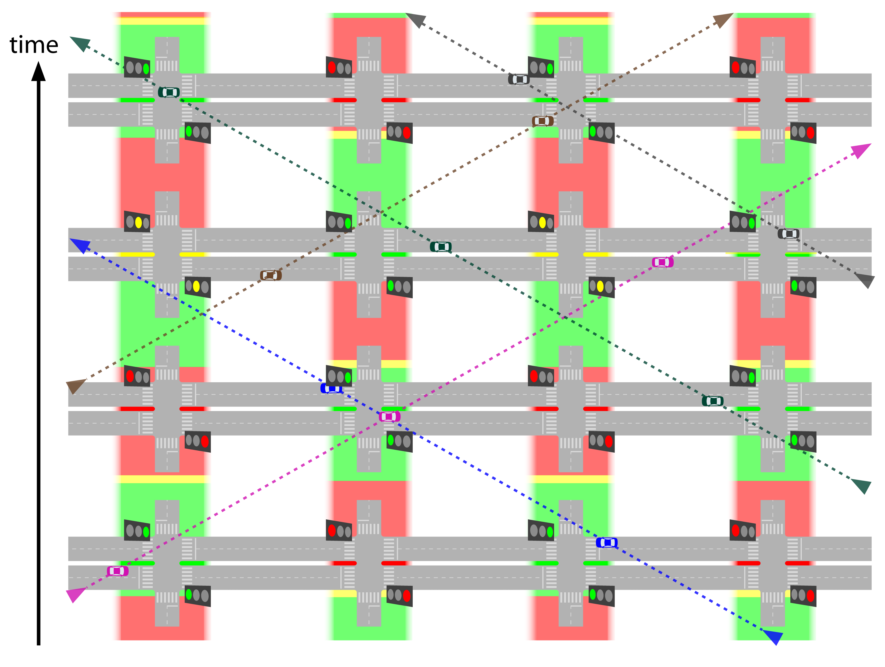

#[Intersections and traffic signals](toc.md#toc)

## Basic Concepts

**"Change means movement. Movement means friction. Only in the frictionless vacuum of a non-existent abstract world can movement or change occur without that abrasive friction of conflict."** - Saul Alinsky, political activist, 1909 – 1972

### About intersections

Intersection is the area where two or more roads encounter each other. The use of the word in Traffic Engineering technical environment implies in "roads for vehicles" and "at the same level", but very often the expressions "at-grade intersections" or "single grade intersections" are used to confirm the concept; for fly-overs and underpasses the term used is "interchange" or still "separated-grade interchange". When more than one mode is involved, the common traffic engineers' wording is "crossing" as in  "pedestrian crossing" (one of the roads is assumed to be a carriageway); recently the term "multimodal intersection" has been applied.  

By this definition, intersection implies in conflicts for vehicles to use the same space, and can refer to an unidirectional T-shaped or Y-shaped confluence area; the conflicts there gets clear when there is no space to accommodate the two incoming flows on the exiting stream in a congested situation (figure \fignum(crowded-y-junction)). Conversely a channelled Y-shaped junction may not be an intersection (figure \fignum(channelled-y-junction)).

Considering the majority of cases of two or more roads meetings where there are many possible turning movements -- not all conflicting --, intersections can be seen as several adjacent intersections as well; i.e., an intersection is a larger conflict area that is composed of smaller conflict areas (=smaller intersections).

Once footpaths (or "roads for people") are more important to accessibility in populated areas, carriageways are usually constructed between footpaths. When two carriageways encounter, several walkways crossings are adjacent. So, a multimodal intersection encompasses a larger area where people conflict to use the same space. For clearance, let us remember that drivers and passengers are people.

The higher the number of conflicts in an intersection or in a crossing, higher is the time people will need to cross it safely.

If the frequency of vehicles arrivals at the intersection -- pedestrians and vehicles at a crossing -- is low, eventual passage negotiating is enough to maintain safety without compromising travel time.

If over the years the vehicle frequencies along the day rise to the point where queues happen often and last long or the time required to pedestrians to cross safely becomes too long is the moment to intervene.

An intervention is justified by the comparing the present value of costs for its implementation, maintenance and operation against the present value of its benefits, of which the most easier to establish are the time savings assuming a safe operation and the costs directly related to it (as fuel consumption and pollution).

Interventions start with zebras and yielding signs. Channelling the vehicles and creating refuge islands is a manner to clearly divide an intersection in several smaller intersection components, improving traffic safety and reducing the overall delay; roundabouts or mini-roundabouts are ways to channel vehicles as well. Above a certain point, traffic lights are required and they may grow in really complex ways to accommodate all conflicts; then traffic diversion and restricting direct movements come at play... until grade separation becomes necessary.

Ideally a separated-grade traffic solution eliminates intersections (figure \fignum(separated-grade-no-conflict)), but in practice, due to space restrictions, intersections eventually remain (figure \fignum(separated-grade-intersections-remain)).

### General Concepts

The concepts we present here are mostly related to understanding the equations related to delay and queues sizes in signalized intersections, without intention to be a complete reference about it. For basic concepts the reader may want to further investigate the concepts of traffic density and traffic headway, and how they relate with traffic average speed and traffic flow. We provide further references for traffic signals in the bibliography.

Before that, we emphasize that when applying formulas, attention should be given to units and units conversions; the appropriate dimension to perceive phase times in traffic lights or the time to walk or ride a few blocks is seconds while we better perceive speeds in kilometres or miles per hour. It is useful to remember that 1 hour is the same as 3600 seconds and one mile is approximately 1.6 kilometres and 1 kilometre is approximately 0.6 miles.

###### cross-traffic-turn and kerb-side-turn

For this chapter we have excluded the expressions right-turn and left-turn because they have different meanings in different hand-way systems. We have chosen to adopt cross-traffic and kerb-side-turn instead.

**cross-traffic-turn**: a vehicle movement to exit the current traffic stream direction that requires crossing the flow in the opposite way. If a busway or a bike lane is present near the medium, there is also conflict with BRT vehicles or bicycles going straight in the same way as in opposite way.

**kerb-side-turn**: a vehicle movement to exit the current traffic stream direction that normally does not cross any vehicle flow. This movement conflicts with people on the side walk in both ways and if the road abridges curb-side busway or a curbside bike-lane, there is conflict with that traffic as well.

**u-turn**: a vehicle movement to join  the traffic stream in the opposite way of the direction of its current flow. Depending on the width of the medium this movement can be less conflicting than the cross-traffic-turn or more conflicting as the speed has to be lower. For this reason, u-turns are sometime prohibited at existing intersections and promoted away from the intersection, creating another intersection exclusively for it. Due to road geometry restriction or other considerations, this movement eventually is channelized to start from a waiting area from the curb-side of the road, in which case it will conflict with both flows in the same way a cross-traffic-turn from a perpendicular street would.

, kerb-side-turn\(blue car\), u-turn without space \(red car\), u-turn with space \(pink car\) for right driving way as in China, US, Brazil and most of Europe. Image courtesy of Elebeta")

, kerb-side-turn\(blue car\), u-turn without space \(red car\), u-turn with space \(pink car\) for left driving way as in India, Indonesia, South-Africa, Tanzania, Australia and UK. Image courtesy of Elebeta")

###### Speed

For application with the concepts outlined in this chapter, speed, to which we use the letter V from the synonymous velocity, is the average traffic speed of all vehicles in a segment. It would be measured by the mean time of all vehicles crossing the segment divided by the segment extension. Under our modelling intents (that is capacity evaluation) it can be imagined that all vehicles are moving in that speed.

Still matching the broader concept of speed -- the ratio of motion expressed in distance per unit of time -- it is useful to remember that given a segment length (D_segment, for distance), knowing the speed (V_segment) is equivalent of knowing the travel time (Time_segment) through the segment and vice-versa, as the equivalent equations show:

 

###### Delay

Delay is the additional travel time, if not explicit, the base reference is the travel time without any conflicts, in an ideal situation where the passenger, pedestrian or driver is the only user of the road (no other drivers, pedestrians users or traffic lights).

###### pcu

A passenger-car unit, or pcu is a reference used to bring different vehicle types to a common denominator. The conversion factor from a certain type of vehicle to a passenger car unit depends of application intended after the conversion, being eventually calibrated for an specific use in an specific situation (for example if stress upon the pavement or congestion potential is considered, if such is in urban environment or in a highway, in a ramp or in plain terrain).

In any case, a motorcycle for example tends to have an equivalent of less than one vehicle, and a mini-bus is equivalent to more than one vehicle; the larger and heavier the vehicle, higher the equivalence is.

###### Flow 

Traffic engineering borrow concepts from fluid mechanics and uses "flow rate" as a measure traffic intensity.
From that definition, the word "rate" is commonly dropped and "flow" alone becomes treated as physical quantity expressed by the number of vehicles crossing a transversal section (or cross-section, like a stop line) during a certain time interval. Flow is usually represented by letter q in equations, but we will avoid that here and use the full word instead.

It should be noted the use the word "volume" to express the same idea is accepted even it is conceptually even more far from the original definition (fluid mechanics original comparative term would be "volume flow rate" even "mass flow rate" is more appropriated reference as the same number of vehicles can be compressed); volume should refer to total number of vehicles in the same way litres refers to volume and litres/second refers to flow in hydraulics. The term is specially common in the expression "volume/capacity ratio", which makes particular sense.

 

Flow can also be expressed for pedestrians, bicycles or even passengers (per hour).

###### Capacity and Saturation  

The capacity (flow rate) of a segment is given by the lower capacity of a section within it, the term "bottleneck" for the lower-capacity-section express this concept quite clearly.

The capacity of a section by its turn is defined as the maximum flow a section can handle under prevailing use. It is subject to the number of lanes, width of lanes, ramp inclination, the use of surrounding areas --  as parking and stopping regulations, presence of intersection or traffic light ahead, bus stops existence and frequencies and  cultural driving behaviours.

Capacity can be easily and objectively measured, but some of the influential factors cannot. Many models have been developed to improve forecast of road capacity based on the knowledge of design and use of surrounds, but  even the more detailed simulators needs careful calibration to correctly represent driver behaviours changes, that tend to be unique to each place.

The simpler models commonly don't fit exactly to theories either and are usually adjusted by experimental evidence. These resort to the concept of **basic saturation flow**.

Basic saturation (flow rate) is the capacity for a section of a given standard ideal carriageway, divided by number of lanes of that given standard carriage way, it is commonly expressed by "s0".

Capacity and speed are inter-dependent and the maximum flow does not happens when speeds are maximum. This is due to the fact that the distance a driver maintains from the vehicle in front of it raises more than proportionally than the speed increase. In a section of unconstrained road, the speed maximum capacity occurs between 60 and 80 kph (km/hour).  

Based on extensive observations, capacity models then define a way to forecast a **saturation flow** multiplying the basic saturation flow by adjustment factors to account for various non-ideal geometric, traffic, and environmental conditions of a given section, such as number of lanes, lane width, presence of heavy vehicles, grade, parking facilities, bus blockage, area type, turning traffic along the segment, radius of turnings, pedestrian crossing traffic, but not considering traffic lights.

Saturation is commonly written as S in equations, but here we use "SaturationFlow" or "SatFlow" to avoid confusion with demand saturation level, usually "X" that represents the relation between demand and capacity for a given infrastructure element as an intersection or a station.

 ")

Saturation (flow rate), therefore, is the capacity of a section that is **not** under the influence of traffic light; for a section that approaches the traffic light, saturation is the capacity assuming a constant green, which would equal the flow observed during the queueing discharge (after a few regularization seconds). For this reason saturation maybe called discharge (flow rate). When working in an specific location, saturation of sections can be measured, so the resulting product of all this factors is known.

A practical rule, even distorting a bit the concept of ideal conditions is that: for urban environments, the observed saturation of a lane is 1800 pcu/hour. For the purpose of capacity measuring an 18-metres-articulated bus is equivalent to 2.5 car-passengers-unit. So in a busway, the saturation per lane is 720 articulated-bus/hour.

 

###### Continuity

Although no direct formula application about continuity is used in this chapter, one basic equation of an intersection is that all the flow into the intersection has to exit the intersection.

### Traffic signal concepts

Traffic lights are a very common intersection management tool in business district areas where the BRT corridor design is likely to face the more challenging problems. Traffic lights controllers can be coordinated and actuated (use detection) by more or less complex technology and algorithms, a lot of research and development have been made in the last 30 years, but its use is still relatively limited. The concepts presented in this chapter are useful to understand BRT design requirements to program traffic lights, be it on simpler controllers or as policy delimiters to more complex systems.

Traffic lights eliminate some of the negotiations between vehicles on arrival, by determining which movements may proceed at a given moment. Traffic lights may allow conflicting movements, usually not all of them intense; pedestrian crossing the transversal street is commonly one of them. By reducing negotiations, traffic light prevents that all vehicles approaching the intersection reduce their speeds, raising the time each vehicle spends on the intersection itself, which is an area by definition. Traffic signals increase the throughput while keeping intersections safe.

###### Phase

One set of movements that are allowed to occur at the same time is called a signal phase. It should be noted that some movements are allowed during several phases; in many countries, allowing kerb-side-turns at all times is the standard. Some writers, ourselves eventually included, may use expressions like "allowing a particular turn in the beginning of  phase two" when technically it should be "adding a short phase before phase 2 where particular turn will be allowed". 

###### Effective green time (T_green)

The phase duration (or length) refers to its "effective green" time, which is the time vehicles doing the movement considered are effectively moving, which may start a little after the green light is given and end in the middle of yellow lights (where such is used), or in the first moments of red (clearance interval). For this chapter, where queueing and intersection capacity is evaluated, green time means "effective green" time.

###### Cycle time (T_cycle)

Excluding situations where special phases are activated by detectors, the traffic signals on an intersection repeats the order of the phases successively in cycles. The cycle time can be measured as the time between the green light is given to a movement till the next time it is given to that movement again (after it has changed to red once). In this chapter, "cycle time" alone refers to a traffic light cycle time (route cycle times are not discussed).

###### Red time (T_red)

For the interest of intersection capacity and queueing evaluation, red time means cycle time minus (effective) green time

###### Lost time

Lost time is the period between the end of the effective green of a phase and the start of the next. Lost times depends both of the signal programming for yellow times and overlapping red (clearance red), enforcement policy, and driver behaviour (longer the lost times are associated with safer intersections), but are fixed values for the given conditions.

We refer to lost time as the total lost time per cycle, but lost time can be further split in start-up and clearance to each phase, each of them being nearly 2 seconds. One can generally consider that a four-phase signalized intersection has lost time of 16 seconds, meaning that total lost time each cycle is 16 seconds.

##### Traffic light plans

In the same way as intersections in general, the higher the number of turning movements in a intersection with traffic lights, higher is the difficult to serve them all. Some movements can happen simultaneously, some cannot. Reducing the number of phases implies that the number of lanes of the approaches to allowed movements on any phase will be higher and the intersection will have an overall higher throughput ([see section \sectionnumname(restrict-turning)](restrict-turning.md)). 

The optimal phase times in a signalized intersection is such that the cycle time is as brief as possible without growing queues.

Having the minimum cycle is optimal because it implies in the shortest possible red times, which is similar to shortest possible waiting times. For not having queues, if demand and saturation flow is known for each approach, the minimal number of effective green seconds per hour required for that approach is without forming queues can be calculated. If that is done for all approaches, the minimum effective green time for that intersection as a whole is known; the total number of effective green seconds in an hour shall be way bellow 3,600, and the difference shall be used as lost time.

Contradictory as it seems at first, the best signal programming is such that it has the maximum lost time per hour, because that implies in the highest number of cycles per hour.

For example, if required green time for vehicles in the intersection is 3,200, the intersection is close to collapse. It means that there are only 400 seconds per hour to allow pedestrian crossings and add up the lost time. Assuming two vehicle phases plus a minimal pedestrian phase of 6 seconds plus extra 4 seconds for each phase change, each cycle will need additional 18 seconds (= 6 + 4 * 3 ) beyond vehicle green time. This extra time to all cycles during one hour is defined as 400 seconds, so the intersection can have a maximum of 22 complete cycles (= 400 / 18) ; or 162 seconds (almost 3 minutes) of cycle time.

Unlikely infrastructure, that must be sized based on the peak use and eventually become underused in other times of the day. Traffic signal timing plans for peak moments would lead to unnecessary delays at other moments of the day. Traffic light plans, should change along the day as demand changes; one extreme application example is shutting down (or yellow blinking) a signal late night and early morning.

Traffic signals programming shall change along the day, so green, red and cycle times must change based on different programmings for the time of the day (week and season too) and, where available, based on traffic detection applied to parameters in the programming for that moment. When we discuss these features as fixed, we must understand it as the limiting parameters for the traffic controller that allow adaptive changes based on detection.

We look at infrastructure layouts associated with traffic-signal plan to the peak-hours of the day for each flow, if there is enough capacity at this moments, certainly there will be in others, although traffic signal programs need to be different to minimize travel times. To represent the peak we both use and measure the busiest hour of the day for the given flow (as a reminder: we survey data with smaller intervals than on hour, so a given measure of busiest hour might have happened from 7:15 AM to 8:15 AM for example).

###### Traffic signs coordination

Coordination is the synchronization of several traffic lights along a path to produce a "green wave" for that route, eliminating waiting, while still keeping required/projected capacity for all flows. With proper planning, it is possible to coordinate several routes (including pedestrians and to some extent, public transport) in the same area by establishing priorities among them. Eventually routes with lower priority end up having more breaks in their green waves and some intersections will need to have irregular green times for the transversal flows (still fixed in a larger cycle measure: one long, one short, one long, one short..). 

###### Detection or actuation

Actuation is the form that user has informs its presence to a traffic sign controller, for example:
- a pedestrian pressing a button to request a crossing (figure \fignum(pedestrian-button));
- a vehicle passing over a magnetic induction loop buried in the traffic lane(figure \fignum(inductance-loop))

Actuation can be used in many ways, isolated or in conjunction to control traffic signs:
- adding a required phase for pedestrians or cross-traffic turns (semi actuated control);
- determine the length of every phase (full actuated control);
- activate a pre-established, eventually coordinated plan (actuated pre-time control);
- establish transit priority (see section \sectionnum(active-priority));
- input a central traffic control, that in turn computes several inputs to select a plan of operation;
- input central controllers that adjust traffic signal parameters by evaluating alternative strategies for the requirements in real-time (adaptive control, among which "Split Cycle Offset Optimisation Technique" or "SCOOT model" is  a common reference). 

### Intersection capacity

Considering the definition of intersection as the area where vehicles come into conflict, the capacity of the intersection should be measured as the total number of (equivalent) vehicles that crossed it, adding up all the movements.

But in the perspective of this chapter, when not saying "overall", intersection capacity alone refers to the entrance section (the approach or stop line) of a road segment under study. Furthermore, we are particularly interested in signalized intersections, assuming that the corridor where the BRT is placed has preference at smaller unsignalized intersections that don't cause other meaningful interference to mixed-traffic or to BRT that is not included in the basic saturation flow measures.

###### Relative green (K_green)

The proportion of time that the flow to a given approach can cross the intersection. 

The previous and following equation applies to fixed cycles, when planning coordination, the first steps also consider regular times, but to measure relative green of a coordinated traffic light with irregular times, one considers the total green time along a repetition (short, long) cycle.

###### Relative red (K_red)

The proportion of time that traffic is hold in a given approach.

By the relation of this definition and that of red time, , we can conclude that  and therefore:

###### Capacity at signalized intersection approach

It is simply the saturation flow of the approach times the proportion of time it is in operation. Unless stated otherwise, intersection capacity refers to this.

The capacity away from the intersection can be considered by this definition, if one assumes that K_green is equal to one, i.e., an uninterrupted flow.

###### Demand saturation level (X)

Demand saturation level is an adimensional form of expressing demand, by comparing it to the maximum that the infrastructure under analysis can serve. Applied to a road section it is given by demand flow (how many vehicles want to cross the section for the duration of time interval) over the saturation flow. This means that if the section is the entrance to an intersection, the reference is the discharge flow rate (how many vehicles can cross the section if the traffic light is green during the whole interval).

Demand saturation level is sometimes referred only as "saturation level" or only "saturation" which can easily create confusion with "saturation flow", we use "demand level" and "X" on this chapter.

###### Demand to signal capacity level (XSignal)

This is a variant form of expressing demand saturation level at the traffic light that instead of comparing it to the maximum possible throughput, compares it with the possible throughput under current programming. It is given by demand flow over capacity flow. The reference is the traffic sign effective capacity (how many vehicles can cross the section during the amount the traffic light is green during the interval).

Demand to signal capacity level is particularly relevant for the calculation of traffic sign delay bellow in the particular formulation we use and sometimes it is called "signal saturation level" as the following definition is also possible.

###### Signal Delay (T_signal)

The calculation use the assumptions that arrivals are random and departure headways are uniform, which is applicable only for under-saturated conditions and predict infinite delay when arrival flows approach capacity. This is realistic for design purposes, as we intend to promote under-saturated conditions. 

Signal delay is composed by two terms:
- the first term (T_queue) is the delay due to a uniform rate of vehicle arrivals and departures at the signal.
- the second term (T_random) is the random delay term, which accounts for the effect of random arrivals. But if demand to signal capacity level is bellow 50% than it should be ignored.

The first term is deductible as the area bellow the queueing in figure \fignum(traffic-light-diagram) over the number of vehicles during a cycle (DemandFlow * T_cycle).

}")

Now, the extra delay in queuing, caused by the non-regularity of arrivals in the traffic light (T_random) is a function of the demand-to-signal-capacity level (Xsignal) and a regularity of buses arrival coeficient (Kreg).

If the signal saturation (Xsignal) is low, the randomness of arrivals will not generate extra time in queueing formation. As the signal saturation increases, the impact on extra time due the expected randomness of arrivals becomes bigger than the increments. If the signal saturation is bigger than 1 (there are more buses willing to use the lane than what the traffic light can handle) there will be severe busway congestion (congestion would happen even if there was no randomness of arrival at all). So, the extra queueing delay due randomness is calculated by: 

<!--[equation-random-delay-definition](img/eq-x-definition.png "T_random = {{XSignal - K_reg } over { 1 - XSignal } } *{ 1 over SatFlow }")> </!-->

If Xsignal ≤ Kreg 		, then 	T_random = 0	;
If Kreg ≤ Xsignal < 1 	, then 	 	;
If Xsignal ≥ 1 		, then 	there would be severe congestion (T_random -> ∞).

Where, besides the already defined variables we have:
Kreg = regularity factor, it is a number related with the chance a bus has to arrive within the signal cycle he is expected: it would be equal one, if there was total regularity on the buses arrivals, it would be 0.5, if half of the buses arrive more than one signal cycle later than what they are expected; 0.5 is the used value to represent aleatory arrivals.

This formula is a slight variation of the model proposed by Webster in 1958, slightly more simple than originally proposed but with a smoother transition when the random delay becomes relevant than the practical modification most commonly applied. 

