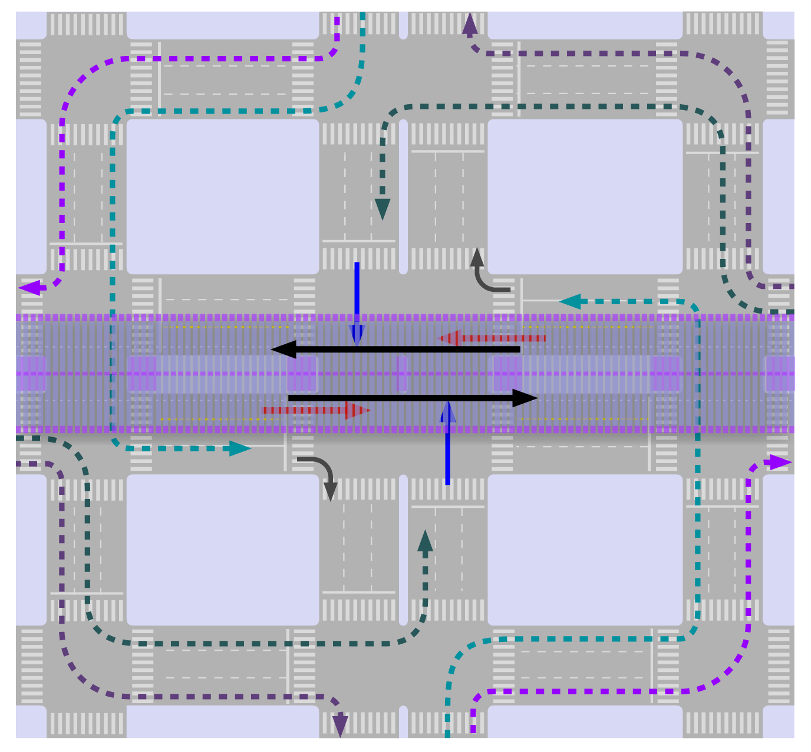
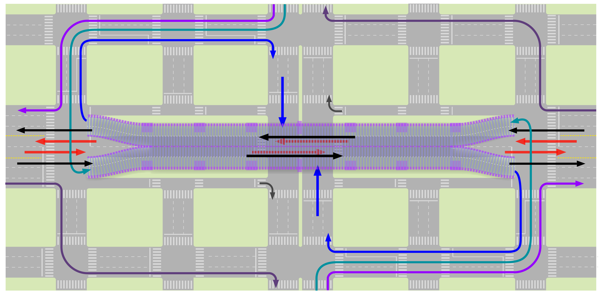

#[Intersections and traffic signals](toc.md#toc)

## Grade Separation
**"Conflict can and should be handled constructively; when it is, relationships benefit. Conflict avoidance is _not_ the hallmark of a good relationship. On the contrary, it is a symptom of serious problems and of poor communication."** ― Harriet B. Braiker, psychologist, expert on stress management, 1948-

Grade-separation brings many benefits from the perspective of travel time savings by raising intersection capacity for both BRT vehicles and mixed traffic vehicles. But the infrastructure can be costly, depending on local circumstances.  In many instances, the time savings to BRT passengers and to private vehicles will fully justify the added infrastructure costs, but limited capital resources will typically constrain infrastructure expenditures.  

### Criteria for grade separation

In all of our BRT studies to date we have never really had to resort to a single flyover, meaning that there were always solutions to guarantee BRT operations that would reduce overall current travel times with the available space. In other words: without resorting to grade-separation, solutions are likely to be found where the advantages to public transport passengers are greater than prejudices to private vehicle users. 

Nonetheless, when the capacity of a 4-phase intersection is reaching saturation (more than 450 vehicles/lane/hour in 180 seconds cycle times), it is fairly typical for engineers to suggest the construction a flyover or an underpass that allows straight movement for one main road (2 of the 12 movements), while all other movements remain at the same level. Such general inclination often leads towards a political understanding that flyovers constructions along the BRT corridor are necessary. Besides that, a corridor project usually have to deal with existing flyovers.

The introduction or existence of flyovers or underpasses in the corridor requires special treatments for BRT systems, but they represent an opportunity to dramatically improve BRT vehicle operation.  Exclusive busway use of a flyover is a successful technique used in several existing BRT systems despite its potential major adverse visual impacts, which are highly undesirable from an aesthetics standpoint, in cities and urban areas.

An ideal separated-grade solution should let remain only low intensity intersections (low enough to not require traffic lights) If it removes mixed-traffic and BRT intersections, then it is best to keep BRT at the grade where access is facilitated, likely to be street-level with at-grade crossing.

If the grade separation solution will not eliminate all conflicts, the first option is to use grade separation infrastructure to BRT usage and exclusively for BRT use if needed.

While the discussion in this section is concentrated on flyovers as a means of grade separation, underpasses are frequently the preferred option from an aesthetics standpoint. Generally the cost of a busway on a flyover will be at least ten times the cost of a normal at-grade busway. The cost of a busway in an underpass will be similar to that of a flyover unless there are adverse subsurface conditions such as the presence of services (utilities), high water tables and hard rock conditions that may result in underpasses not being technically or economically feasible.

### Station location with grade separated solutions

If the grade-separated solution design maintains BRT lane through intersections, same concerns discussed without grade-separation about queue blocking the stations apply.

When BRT lane is grade separated, hindering the station is not a concern, but effective pedestrian access becomes a major issue.

In most instances (ramp of 3% and headroom of 4-5 metres), grade-separation will imply in placing the stations more than three hundred meters away from the intersection.  This siting restriction will add walking time for customers travelling between the station and the intersection, which crossing street is likely to abridge key destinations.  The Quito Central Norte line uses grade separation quite effectively with tunnels whisking BRT vehicles through congested intersection locations.  However, the tunnels also imply that at important destinations, such as the Plaza de las Américas (Plaza of the Americas), the closest station is a considerable distance away (Figure quito-under-roundabout-bad-station-location).  Thus, for the likely high number of customers from/to this busy area, the time savings from the grade-separation can be essentially lost due to the longer walk.

As an alternative to obtain intersection efficiency (with time savings that serve all passengers through the section) at the cost of convenient station location (that serves local-specific passengers) it is possible to place the station beneath or above the intersection. Many underground metro stations utilise station in this manner.  The Metro Center station of the Washington Metro exits directly into the basement floors of commercial shops.  In such cases, though, accessing ground-level shops and offices will require a grade transfer for customers, implying either stairs, escalators, and/or elevators.
Both the Brisbane and Ottawa BRT systems site stations at the tunnel level.  In Brisbane, the station is just before the tunnel and thus provides good customer access to local destinations (Figure Brisbane-station-before-tunnel).  In Ottawa, the station connects directly to a commercial shopping centre (Figure Ottawa-station-inside-tunnel).  Further, in the case of Ottawa, the tunnel station nicely protects customers from the harsh winter temperatures. Quito also has achieved great success with its Villa Flora station that goes beneath a heavily-trafficked roundabout on Maldonado Avenue (Figure quito-under-roundabout-good-station-location). 

Effective pedestrian access as well as visually neutral solutions can be designed. For TransMilenio Phase II’s “Avenida Boyacá” station along the Avenida Suba Corridor, the adopted solution was to locate the station above Avenida Boyacá, level with the flyover. Pedestrians access the platform via an elevator from a small pedestrian plaza where fares are collected. This solution allowed for the strategic location of this station, which will make future transfer points on the projected Av. Boyacá closer from each other. Ultimately, the implementation of solutions of this sort will depend on budgetary constraints.

### Restricting turning movements together with grade-separation

As said in introduction to this section, unless all vehicle-intersections are eliminated from the BRT lane by the separated-grade solution, the first option is to consider grade separation infrastructure to be used by the BRT. In such cases, concern is to determinate if cost of separated-grade station is justified by the users of that station time-savings and can be afforded. This cost is the infrastructure and/or the time losses generated to private vehicle users that will loose a second or a third lane on the separated-grade infrastructure (and if it can be politically afforded by the project too).

A second possibility is to direct BRT vehicles to the flyover in mixed traffic (see \secnum(merging-with-mixed-traffic), that will result in stations being far from the intersections. Additionally, this configuration can be particularly problematic if there is a connecting BRT corridor running on the perpendicular street below the flyover or above the underpass.

The third possibility is when the flyover is built on the road perpendicular to the BRT corridor.  In this case, the flyover does not introduce any special difficulty in relation to the (same-level) intersection already discussed and if it cannot eliminate the intersection with mixed-traffic, it can certainly alleviate the intensity and the number of conflicts, increasing the BRT green time (as this subsection will lead us to conclude by analysing the following last possibility).

The last possibility is that the fly-over is let for mixed traffic alone an BRT remain on the street level. As the others don't create intersection with BRT, this fourth possibility is the only of interest for the reminder of this subsection (all four must be considered when evaluating benefits though).

If a single flyover in the median is built, the BRT vehicles in the median will have to cross the mixed traffic going on the flyover. This scenario creates either the need for a new signalised intersection prior to the flyover, or a merging lane where the BRT buses and mixed traffic can cross, introducing possible delay and confusion for both the BRT system and the mixed traffic.  Figure \fignum(fly-over-conflict) shows the conflict.

If two separate access for the flyover, one for each traffic direction, are constructed, it is possible leave a space between them for the BRT system to continue along the surface as in figure \fignum(no-fly-over-conflict).

In this configuration, the BRT will intersect the crossing street under the flyover, so we must consider the alternatives of section \secnum(restricting-mixed-traffic-turns) also with the introduction of the fly-over to reduce the number of phases. We present results to BRT green times with the insertion of a grade separation infrastructure of two lanes per way (figure \fignum (fly-over-the-intersection) maintaining the assumptions in section \secnum(comparison-examples)): volumes are equal in all approaches, right and left turns each represents 25% of the demand and no u-turns (therefore 50% of traffic is straight), no pedestrian-only phases required (it is possible to cross the intersection with the given phases) and 90 seconds is still the cycle time for reference.

Although the flyover can cause the impression that four new lanes are created, no mid-block extra width is created (figures \fignum(fly-over-conflict), \fignum(fly-over-access) and fignum(no-fly-over-conflict)). Eventually the intersection under the flyover can have some extra width, but usually two lanes near the median are used to place the supporting structure of the flyover, so there is in fact only two extra lanes in the intersection as a whole. The non-interrupted flow in these four lanes is the benefit that will be evaluated bellow.

In our example, the first problem to the mixed traffic arrives at the fly-over access as half of the traffic has turning intentions, if let to do this turns at the intersection (under the fly-over or above the tunnel) or if the detours start after ramp beginning, the single lane let to mixed-traffic using to stay on the fly-over is not enough. Widening or sharing space with BRT is required. The solution presented in section \sectionnum(Merging with mixed-traffic in narrow sections) does not apply here without further complications as there is two downstream sections (overpass and ground) to be managed. Designing with the assumption that the intersection will not congest because the design is good for the forecast demand is simply naive: when it comes to cars, all the designer can expect is to improve capacity, sooner or less sooner congestion will return. Given our goals, place BRT to share space with cars in this potential bottleneck is a bad proposal.

So the maximum capacity we present for mixed traffic is still subject for the intersection bellow the fly-over working well. If it gets congested, the access to the flyover will also be congested. Not only for proper comparison with the solutions without grade-separation, but also because the effective access to the "intersection plus flyover" conjunct has 3 lanes for mixed traffic, we present the results per lane, assuming each intersection approach has 3 lanes, as detailed bellow:

- average lane capacity: the average of the mixed-traffic lanes capacity that would be measured at the stop lines approaching the main intersection (on the presence of flyover, mixed-traffic parallel to BRT approach considered is only 3 lanes, but only 2 lanes were effectively used to balance the traffic-sign);
- overall intersection capacity per lane: in loop configuration, vehicles pass twice through stop lines in order to execute cross-traffic-turn, the second pass is not count to give this capacity , except that it does not count the second passage of the same vehicle.
- total throughput with flyover and auxiliary intersections per lane at intersection: this adds the flows that were completely diverted away from the main intersection (detours and flyover) as if they were effectively passing through the intersection. By bringing the value to the number of lanes of the intersection, this presents a practical estimative of how much the capacity of the main intersection can be pushed to benefit from using the auxiliary ones and flyover as a whole.

Options where the detours are bellow the fly-over assumes that the height clearance makes it possible, which is not always the case. Access ramps from/to perpendicular streets may also be taken into account in order to make turning detours on the flyover possible.

\table(Flyover Capacity Examples)

| option| cycle time| phases| BRT direction straight flow| BRT direction kerb-side-turn detour| BRT direction cross-traffic-turn  detour| perpendicular direction kerb-side-turn detour| perpendicular direction cross-traffic-turn  detour| figure| BRT green time (seconds) | average lane capacity (pcu/hour) | overall intersection capacity per lane (pcu/lane) | Total throughput with auxiliary intersections per lane at intersection
|-----|------|--------|-----------|--------------|--------------|--------------------|-----------------|-----------------------------------------------------------|-----------|-----------------|------------------------------|------------------------
| A| 90| javanese| | -| -| -| -| \fignum(conflicting-movements)| 22| 395| 395| 395
| A1| 90| javanese| on fly-over| -| -| -| -| | 16| 329| 329| 439
| E| 90| 3| | -| -| detour| kerb-first| \fignum(detour-kerb-first)| 43| 496| 496| 567
| E1| 90| 3| on fly-over| -| -| detour| kerb-first| | 43| 355| 355| 567
| I| 90| 2| | detour| kerb-first| detour| kerb-first| | 41| 819| 819| 1092
| I1| 90| 2| on fly-over| detour| kerb-first| detour| kerb-first| | 27| 729| 729| 1458
| I2| 90| 2| on fly-over| detour| loop onto flyover| detour| Kerb-first onto flyover| \fignum(real-kerb)| 49| 547| 547| 875
| J| 90| 2| | -| loop| -| loop| | 41| 819| 655| 655
| J1| 90| 2| on fly-over| -| loop| -| loop| | 39| 691| 518| 691
| K| 90| 2| | detour| loop| detour| loop| | 41| 819| 614| 819
| K1| 90| 2| on fly-over| detour| loop| detour| loop| | 35| 703| 469| 937
| K2| 90| 1| on fly-over| detour| loop onto flyover| detour| loop onto flyover| \fignum(real-clove)| 10| 1520| 1216| 1216
| K3| 60| 1| on fly-over| detour| loop onto flyover| detour| loop onto flyover| \fignum(real-clove)| 10| 1380| 1104| 1104
| K4| 45| 1| on fly-over| detour| loop onto flyover| detour| loop onto flyover| \fignum(real-clove)| 10| 1240| 992| 992

Option A1 is fairly common with conventional bus services (as in Bangkok, figure \fignum(bangkok-flyover)) and BRTs (as in Jakarta,figure \fignum(jakarta-senen-intersection) .  Mixed traffic vehicles have access to the flyover and thus are given a substantial priority at the intersection.  By contrast, public transport vehicles servicing the intersection area are often mired in heavy congestion. There is limited benefit of using a flyover or underpass if a four-phase signal timing is maintained.  In our established scenario, the overall increase in the whole intersection capacity is quite small with the capacity only rising from 395 pcu/lane/hour to 439 pcu/lane/hour.
 

With three phases, moving from option E to option E1  curiously adds no benefit with the use of the flyover. Even 50% of the traffic being diverted to the flyover, with the reduction of the approach parallel to the BRT from 3 to 2 lanes while 1 lane is used to cross-traffic turn, let only 1 lane to process both kerb-side turns and cross-traffic turn from the perpendicular direction results in the same relative green distribution with or without the flyover. But mixed-traffic using only 1 lane for such long phase (the same as BRT phase) reduces intersection itself overall capacity materially (71.5%). Adding the flow on the flyover (60%), results coincidentally exactly in the same overall conjunct capacity to intersection + fly over.

Using the flyover with best observed configuration without it (option I, \fignum(kerb-side-detour-under-flyover)), i.e. doing all detours to kerb-side parallel street to turn to desired direction once the other street is reached without using the fly-over, letting only straight flows in the perpendicular street and in the flyover is the option (I1) that results in larger capacity for mixed traffic and not coincidentally, shortest green time for the BRT (27 seconds), ignoring the four-stage alternative. That happens because the only conflict left at the main intersection is perpendicular straight flow (in 3 lanes) against perpendicular cross-traffic-turn (in 2 lanes).  Having 63 seconds of red time may not be unbearable for a low frequency BRT, but almost certainly will not allow a station to be positioned between the two intersections (the main and the auxiliary).

By trying to apply the same scheme using the flyover (option I2, figure \fignum(real-kerb)) moves all the conflicts to the secondary intersection, that will end up being the capacity limiting element for the conjunct, as there are only two lanes in the flyover to handle the straight flow, plus the cross-traffic-flow from both direction (i.e. double flow in two thirds of lanes). The final result for the system end up being worst than some alternatives without flyover.

For the clove like alternatives (options K, K1, K2), adding the flyover and maintaining the loops on the ground (option K1) raises overall capacity for the system in 15% (comparing with option K). Making detours in auxiliary streets to take the bridge (option K2, figure \fignum(real-clove), will make it look like a "real-clove interchange" and, except for the BRT, there would be no intersection (pedestrian phase is also required now). So, BRT phase would be the minimal 10 seconds and equivalent average capacity of lanes would be 1520 pcu/hour. But as all vehicles willing to do cross-traffic-turns at the intersection use it twice, this is equivalent to "only" 1216 pcu/hour.

The fact that this situation is equivalent to a BRT cross only, the cycle time can be reduced to BRT maximum red time requirements.If this requirement is 50 seconds, than intersection cycle can be 60 seconds (option K3) and equivalent overall capacity is reduced to 992 pcu/hour/lane. If it is 35 seconds (may be enough to bring the station 20 metre from the intersection and fit under the flyover), cycle has to be 45 seconds (option K4) and capacity is further reduced to 992 pcu/hour in our example.

Although generic, the assumptions of this exercise are quite common, so there is a strong suggestion that:

- without grade-separation, reducing signal phases to 2 can provide solutions as good as many grade-separated solutions in terms of capacity for mixed traffic and results in better BRT green times.

- to prioritize BRT green times and meaningfully increasing capacity the use of separated-grade solutions must be cleverly associated with turn-restrictions, and the best solutions are obtained if the flyover is on the perpendicular road (was that the case of options I1 and K2, green times for the BRT would be respectively 54 and 76 seconds in a cycle of 90 seconds).

As mentioned before, an intersection cannot be analysed in isolation.  Optimum results are usually obtained when vehicle movements are analysed along the corridor and the entire extended area surrounding  the intersection.

### BRT turning with grade separated solutions

Separated-grade infrastructure can also be used to provide the dedicated turns for the BRT. For heavy traffic corridors where free-flow turning is required to avoid breaking-down the system, the time savings certainly justify the costs.

Bogotá utilises grade separation both to provide dedicated turning infrastructure to BRT operations: overpasses and underpasses links corridors of 80th Street and Norte-Quito-Sur to an exclusive BRT roundabout (Figure NQS-80th-roundabout-photo and Figure NQS-80th-roundabout-topview) and a superlative BRT only third-floor roundabout completed in 2015 to guarantee that the interchange in Norte-Quito-Sur and Calle 6 has no delays (Figure construction-superlative-TransM-roundabout.jpg andfigure   

.")

### BRT through roundabouts with grade separated solution

Construct a busway underpass that goes below the roundabout and avoids all conflicts with mixed traffic -- and thus promoting time savings for both BRT and mixed traffic -- is also a possibility, as the examples from Quito with good and bad station locations shows (Figure quito-under-roundabout-bad-station-location and Figure quito-under-roundabout-good-station).

A fly-over is also a possibility, but the design of an aesthetically acceptable solution is very challenging. With the exception of the superlative third floor roundabout above mixed-traffic roundabout of Bogotá mentioned in the previous section, there is no other project we have heard of.

