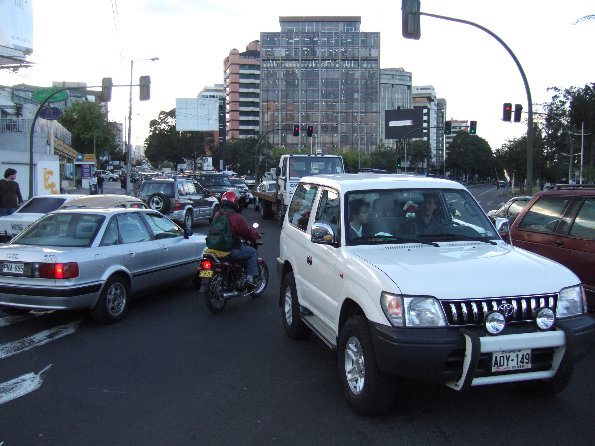
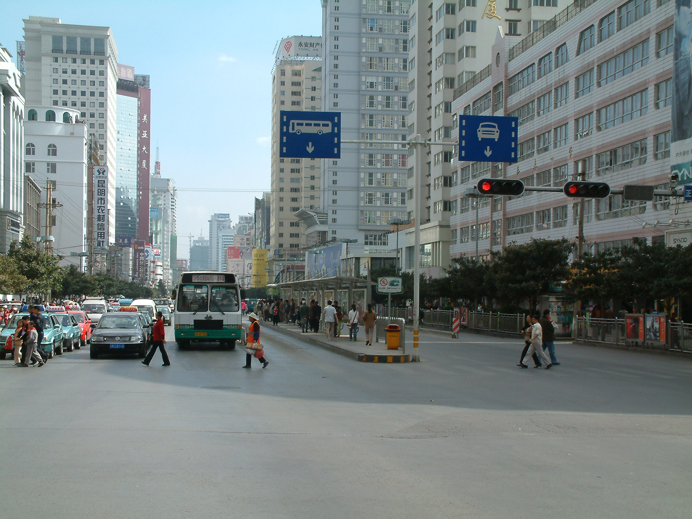
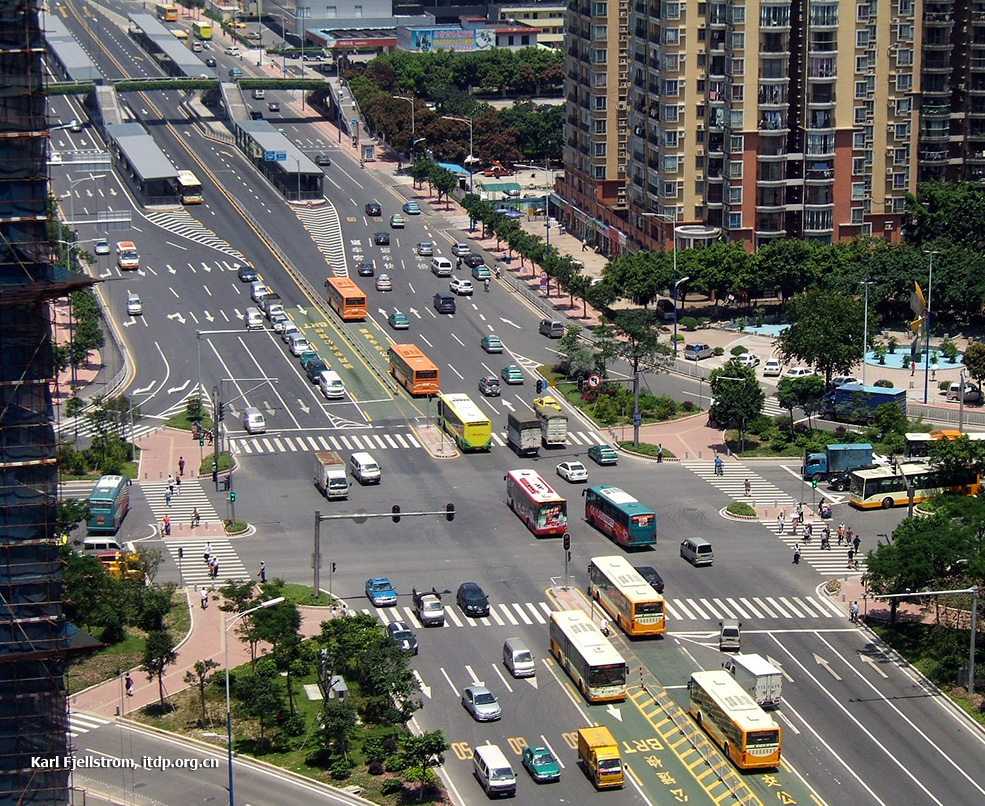
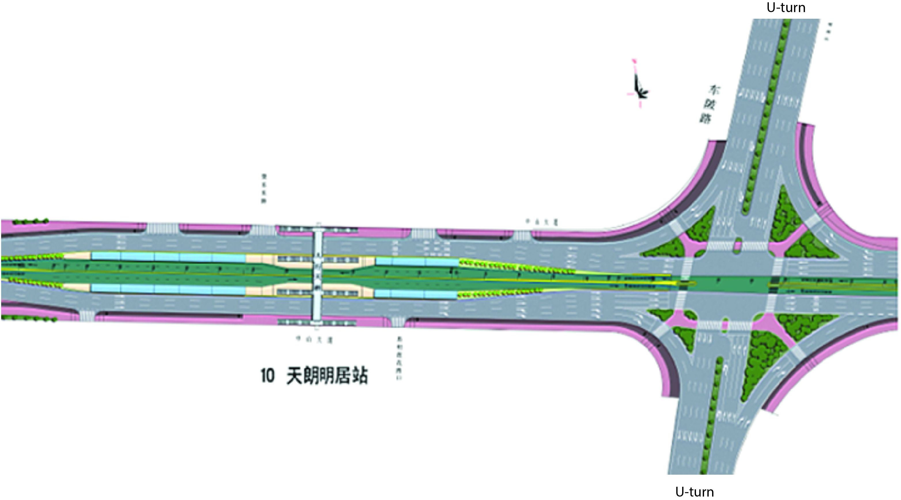
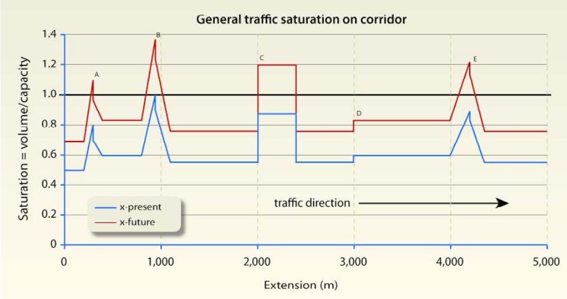

#[Intersections and traffic signals](toc.md#toc)

## Approach to intersection design

**"Idiopathic, from the Latin meaning we're idiots cause we can't figure out what's causing it."** - House MD, fictional character of homonym TV show, 2004 - 2012

BRT systems are generally built on corridors where mixed traffic congestion is already a problem, or where congestion is likely to occur in the near future, otherwise there would be no benefit in building a segregated busway.  The worse the congestion appears, the greater the benefit of the exclusive busway (figure \fignum{congested-intersection.jpg} )  If a BRT system makes public transport services better but mixed traffic worse, it will be less politically successful than if it makes public transport better and also improves mixed traffic flow.  BRT system planners therefore generally try to minimise adverse impacts on mixed traffic.

Even intersections alone are usually less critical than stations, they represent a critical point along any BRT corridor. A poorly designed intersection or a poorly timed signal phase can substantially reduce system capacity and speed, specially by hindering stations. Finding solutions to optimizing intersection performance can do much to improve system efficiency. Generally, the three main objectives of intersection design along a BRT corridor are to:

1. Provide safe and convenient crossings for pedestrians;
2. Minimize delay for BRT vehicles;
3. Minimize delay for mixed traffic.

Walking trips and walking part of trips collect travel time improvements from these objectives, but it should be noticed that, even pedestrians safety and accessibility have the highest priority and some methods take into account pedestrian times to analyse alternatives, the approach discussed here still do not equalize pedestrians by inputting delays into the process. Current procedures mostly try to "fit" demand needs into the available space so pedestrians can do all crossings safely, buslane queues are not long enough to block stations and car desired movements are still possible, without worsening congestion. Keep in mind that if public and private transport users' times were equalized, every street with one bus carrying 50 passengers each two minutes would have an exclusive bus lane.

It is generally not advisable to use a standard intersection configuration throughout a BRT corridor. Rather, it is best to design the intersection for the specific conditions at the given location. The impact of a planned BRT system on overall intersection performance is often a significant consideration when deciding on a service plan for the BRT system, the location of the stations, and the design of the stations.

BRT system planners have used the following tools to rationalize intersections: 

- Simplify the BRT system’s routing structure to optimize turning movements into the corridor;
- Optimize the number of intersections along the corridor;
- Restrict as many mixed-traffic turning movements on the BRT corridors as possible;
- Optimize the location of the station relative to adjacent intersections;
- Optimize the signal phasing and consider signal priority for public transport vehicles.

Every decision and solution proposed during the intersection design process should be technically supported by the elaboration of a comprehensive traffic study, where classified and directional flow counts for cars and pedestrians are carried out at every active intersection (signalized or not) along the corridor being designed. This is necessary to diagnose the current performance of each intersection and forecast a future scenario incorporating the operational changes a BRT corridor might bring. 

### Corridor audits

As a first step to intersection design, BRT system planners should carefully review the existing mixed traffic bottlenecks in the corridor.  It is frequently the case that a small number of bottlenecks are responsible for the vast majority of mixed traffic delay.  These bottlenecks are usually due to one or more of the following conditions: 

- Narrow bridges and tunnels;
- Traffic convergence points;
- Poorly regulated/enforced parking;
- Sub-optimal timing at traffic signals;
- Improperly designed and channelised intersections;
- Badly placed bus stops or unregulated stopping of public transport vehicles.

Quite often a new BRT system can lead to a reduction of the number of lanes available to mixed traffic.  While ideally the removal of a large number of buses from the mixed traffic lanes will avoid worsening congestion in the mixed traffic lanes, this is not always possible, and mixed traffic saturation level may increase

Figure \fignum(corridor-saturation) illustrates the vehicular demand saturation level along a planned BRT corridor and what could be expected if one lane is removed. 

The most serious bottlenecks -- points A , B and E -- are signalised intersections. Point C might be a bridge or tunnel where, for example, lanes are reduced from 3 to 2, increasing saturation by 50 percent. Point D might be a popular destination like a shopping mall where an extra volume of vehicles enters the road, increasing saturation.  It might also be a popular bus interchange, a street market, or an area with regulated on-street parking area. 

If no measures to mitigate the lane removal due to the BRT implementation are made, congestion restricted to point B, will  occur at A, B, C and E. These points now require more careful attention.

### Solution approach

Once the basic routing structure of the new BRT system has been determined, system designers should have a reasonable idea about likely vehicle frequencies within the BRT system. 

Considering the placement of the BRT corridor and its requirements, the non-intersection bottlenecks should be addressed first.  These problem points can generally be resolved through a combination of tightening parking regulation and enforcement, tightening vendor regulation and enforcement, narrowing medians, improving parallel roads, or widening roads if all else fails.  

The second analysis should determine if the busway will congest given the current intersection signal phasing and lane allocation along the BRT corridor. Each intersection in the corridor should be analysed. An example of intersection delay impacts calculation is given in the next section.

Intersections that don't match the BRT requirements should be redesigned.

Once the implementation of the new BRT system requires changing the intersection design anyway, the opportunity should be taken to improve the overall efficiency of the intersection. Packaging these intersection improvements with the introduction of the new BRT system will help to improve the public acceptance of the new BRT system. The less efficient the intersection was before the BRT system, the easier it will be to design the new system in a way that improves conditions for both public transport passengers and mixed traffic. 

### Signal delay on BRT

The table bellow shows an example of the variation of the average of traffic signal delay for each BRT vehicle across an intersection in function of red and  green time duration within a defined cycle time.

Signal delay is given by equation \eqnum(signal-delay-definition) and fixed parameters for the example are:

Cycle time: T_cycle = 80 seconds;
BRT vehicle frequency across the intersection: DemandFlow = 200 articulated-bus/hour
BRT lanes: NLanes = 1 lane
Discharge flow rate: saturationflowperlane = 720 articulated-bus/hour/lane

Signal delay as function of red light

| Red light time  (seconds) | Green light time  (seconds) | Average signal delay (TF) (seconds) | Random queuing delay (TQs) (seconds) | Total signal delay (TS) (seconds) | Demand to signal capacity level (XSignal)
|-----------|------------|----------------|-----------------|----------------|------------
| 0  | 80 | 0.00  | 0.00   | 0.00   | 0.28
| 10 | 70 | 0.87  | 0.00   | 0.87   | 0.32
| 20 | 60 | 3.46  | 0.00   | 3.46   | 0.37
| 30 | 50 | 7.79  | 0.00   | 7.79   | 0.44
| 36 | 54 | 11.22 | 0.18   | 11.40  | 0.51
| 40 | 40 | 13.85 | 2.25   | 16.10  | 0.56
| 42 | 38 | 15.27 | 3.68   | 18.94  | 0.58
| 43 | 37 | 16.00 | 4.53   | 20.53  | 0.60
| 44 | 36 | 16.75 | 5.52   | 22.27  | 0.62
| 45 | 35 | 17.52 | 6.65   | 24.18  | 0.63
| 46 | 34 | 18.31 | 7.98   | 26.29  | 0.65
| 47 | 33 | 19.12 | 9.56   | 28.67  | 0.67
| 48 | 32 | 19.94 | 11.45  | 31.39  | 0.69
| 49 | 31 | 20.78 | 13.78  | 34.56  | 0.72
| 50 | 30 | 21.63 | 16.71  | 38.35  | 0.74
| 51 | 29 | 22.51 | 20.51  | 43.02  | 0.77
| 52 | 28 | 23.40 | 25.62  | 49.02  | 0.79
| 53 | 27 | 24.31 | 32.86  | 57.17  | 0.82
| 54 | 26 | 25.23 | 43.94  | 69.18  | 0.85
| 55 | 25 | 26.18 | 63.00  | 89.18  | 0.89
| 56 | 24 | 27.14 | 103.50 | 130.64 | 0.93
| 57 | 23 | 28.12 | 248.14 | 276.26 | 0.97

Thus, if there are 200 articulated buses per hour in a single lane and there is an 80 second traffic signal cycle with up to a red phase of 35 seconds, there is no difference between total signal delay and average signal delay.  In this case there is no additional delay resulting from the randomness bus queues at the stop light.   However, if there is more than 35 seconds of red time, the random queuing of buses at the traffic light begins to add additional delay.

In summary, intersection delay is largely a function of red time as a share of total signal time.  If demand-to-signal-capacity level is greater than 0.65, random delay becomes significant, and the project design should be changed to give a higher proportion of green time, and/or a second BRT lane on the approach to the intersection should be considered (figure \fignum(bogota-single-to-double)).

.")

