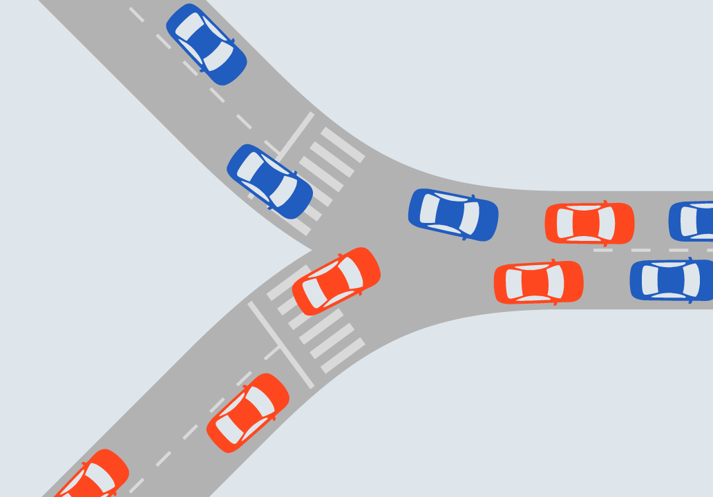
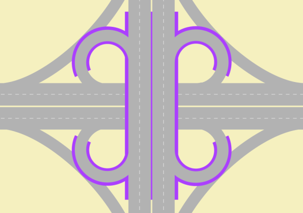
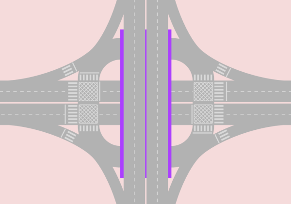

#[Intersections and traffic signals](toc.md#toc)

## Introduction

### About intersections

Intersection is the area where two or more roads encounter each other. The use of the word in Traffic Engineering technical environment implies in "roads for vehicles" and "at the same level", but very often the expressions "at-grade intersections" or "single grade intersections" are used to confirm the concept; for fly-overs and underpasses the term used is "interchange" or still "separated-grade interchange". When more than one mode is involved, the common traffic engineers' wording is "crossing" -- one of the roads is assumed to be a "carriageway" -- as in  "pedestrian crossing"; recently the term "multimodal intersection" has been applied.  

By this definition, intersection implies in conflicts for vehicles to use the same space,and can refer to an unidirectional T-shaped or Y-shaped confluence area; the conflicts there gets clear when there is no space to accommodate the two incoming flows on the exiting stream in a congested situation.

Conversely a channelled Y-shaped junction may not be an intersection.

Considering the majority of cases of two or more roads meetings where there are many possible turning movements -- not all conflicting, intersections can be seen as several adjacent intersections as well; i.e., an intersection is a larger conflict area that is composed of smaller conflict areas (=smaller intersections).

Once footpaths (or "roads for people") are more important to accessibility in populated areas, carriageways are usually constructed between footpaths. When two carriageways encounter, several walkways crossings are adjacent. So, a multimodal intersection encompasses a larger area where people conflict to use the same space. For clearance, let us remember that drivers and passengers are people.

The higher the number of conflicts in an intersection or in a crossing, higher is the time people will need to cross it safely.

If the frequency of vehicles arrivals at the intersection -- pedestrians and vehicles at a crossing -- is low, eventual passage negotiating is enough to maintain safety without compromising travel time.

If over the years the vehicle frequencies along the day rise to the point where queues happen often and last long or the time required to pedestrians to cross safely becomes too long is the moment to intervene.

An intervention is justified by the comparing the present value of costs for its implementation, maintenance and operation against the present value of its benefits, of which the most easier to establish are the time savings assuming a safe operation and the costs directly related to it (as fuel consumption and pollution).

Interventions start with zebras and yielding signs. Channelling the vehicles and creating refuge islands is a manner to clearly divide an intersection in several smaller intersection components, improving traffic safety and reducing the overall delay; roundabouts or mini-roundabouts are ways to channel vehicles as well. Above a certain point, traffic lights are required and they may grow in really complex ways to accommodate all conflicts; then traffic diversion and restricting direct movements come at play... until the grade separation becomes necessary.

Ideally a separated-grade traffic solution eliminates intersections, but in practice, due to space restrictions, intersections eventually remain.

### Approach to intersection design

BRT systems are generally built on corridors where mixed traffic congestion is already a problem, or where congestion is likely to occur in the near future, otherwise there would be no benefit in building a segregated busway.  The worse the congestion appears, the greater the benefit of the exclusive busway (Figure congested-intersection.jpg) If a BRT system makes public transport services better but mixed traffic worse, it will be less politically successful than if it makes public transport better and also improves mixed traffic flow.  BRT system planners therefore generally try to minimise adverse impacts on mixed traffic.

Even intersections alone are usually less critical than stations, they represent a critical point along any BRT corridor. A poorly designed intersection or a poorly timed signal phase can substantially reduce system capacity and speed, specially by hindering stations. Finding solutions to optimizing intersection performance can do much to improve system efficiency. Generally, the three main objectives of intersection design along a BRT corridor are to:

1. Provide safe and convenient crossings for pedestrians;
2. Minimize delay for BRT vehicles;
3. Minimize delay for mixed traffic.

Walking trips and walking part of trips collect travel time improvements from these objectives, but it should be noticed that, even pedestrians safety and accessibility have the highest priority and some methods take into account pedestrian times to analyse alternatives, the approach discussed here still do not equalize pedestrians by inputting delays into the process. Current procedures mostly try to "fit" demand needs into the available space so pedestrians can do all crossings safely, buslane queues are not long enough to block stations and car desired movements are still possible, without worsening congestion. Keep in mind that if public and private transport users' times were equalized, every street with one bus carrying 50 passengers each two minutes would have an exclusive bus lane.

It is generally not advisable to use a standard intersection configuration throughout a BRT corridor. Rather, it is best to design the intersection for the specific conditions at the given location. The impact of a planned BRT system on overall intersection performance is often a significant consideration when deciding on a service plan for the BRT system, the location of the stations, and the design of the stations.

BRT system planners have used the following tools to rationalize intersections: 

- Simplify the BRT system’s routing structure to optimize turning movements into the corridor;
- Optimize the number of intersections along the corridor;
- Restrict as many mixed-traffic turning movements on the BRT corridors as possible;
- Optimize the location of the station relative to adjacent intersections;
- Optimize the signal phasing and consider signal priority for public transport vehicles.

Every decision and solution proposed during the intersection design process should be technically supported by the elaboration of a comprehensive traffic study, where classified and directional flow counts for cars and pedestrians are carried out at every active intersection (signalized or not) along the corridor being designed. This is necessary to diagnose the current performance of each intersection and forecast a future scenario incorporating the operational changes a BRT corridor might bring. 

