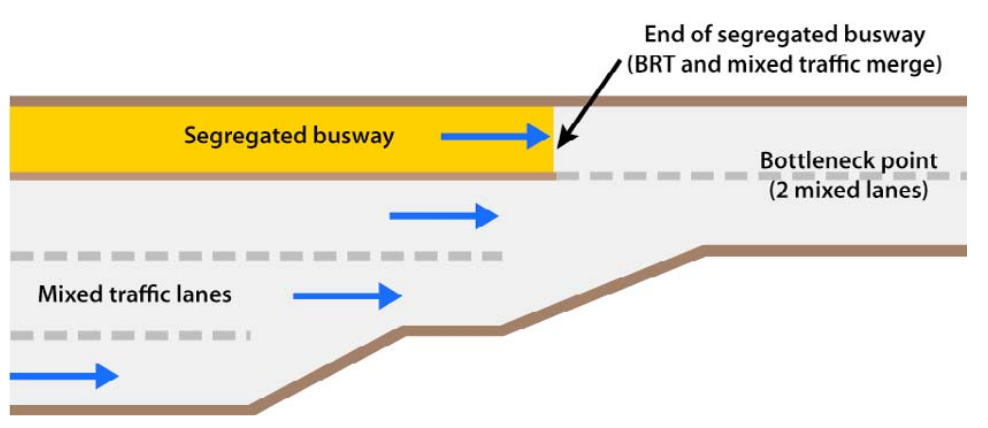

#[Intersections and traffic signals](toc.md#toc)

## Merging with mixed-traffic in narrow sections

**" Well, you would have to say what is the criteria to determine the success of any merger? It would have to be that the companies are stronger financially, that they took market share, and they are on a very steady footing in terms of their performance."** - Kevin Rollins, businessman and philanthropist, former CEO of Dell Inc, 1952-

Sometimes a BRT system must pass through a narrow stretch of road that is impossible to widen. Such areas may include bridges, tunnels, city gates, or flyovers. As shown bellow, having the BRT running with mixed-traffic only in this narrow section may not be too harmful for the public transport system if appropriate measures are made.

This situation can be seen as an intersection (for sure is a bottleneck) as there is conflict for using the same space.

Usually the heaviest congestion occurs not on the critical link but just before it, forming a large queue just to enter onto the bottleneck point. 

When the facility itself is not congested, only the approach to the facility, a traffic signal is generally not needed, and it may be better to end the exclusive busway just a short distance before the bottleneck.  The distance should be sufficient only to allow a convenient distance for merging (40 to 80 metres).  This curtailment of the busway will allow BRT buses to pass through most of the congestion point without provoking any reduction of mixed traffic capacity at the critical section (figure \fignum(narrowing-no-lights)).

If the critical link is an approach to signalised intersection (figure \fignum(narrowing-with-lights)), then  BRT should be given signal priority (active if possible, passive otherwise), the head-start in green phase (T_headstart) should be given by:

 

where:
Dist_stopnarrowsection: distance between the stop line of the signal preceding the narrow section
StartSpeed_BRT: Is an average speed that the BRT vehicle needs of advantage from mixed traffic to reach the section first. We suggest 3 m/s (~ 11 km/hour). Using metres and seconds the equation becomes:

 = {Dist_stoptonarrowsection (metres)} over {3}") 

")

The example given in figure \fignum(narrowing-with-lights) essentially acts as a queue-jumping mechanism in which the BRT vehicles are given an advantage through a bottleneck point.

The headstart, however, is useless works if the facility itself also becomes congested.  If there is a risk that the bottleneck facility itself may become congested (due to mixed-traffic spillback of conflicts ahead of the narrow section), active signal priority based on the detection of mixed-traffic should be used. 

The signal before the section would work normally (or if a signal didn't exist one would be created and flash yellow) until traffic detectors note that the narrow link has become congested (at its most downstream portion).  At that point, the signal would be activated, and a red signal would be given to mixed traffic until the narrow section clears. The use of such a traffic signal will help to avoid congestion inside the busway.  Instead the delay is transferred to the mixed traffic in the previous link, resulting in improved velocity for BRT vehicles at the narrow link. For tunnels, this approach has the extra advantage of avoiding idling vehicles within heavily polluted conditions. 

