#[Intersections and traffic signals](toc.md#toc)

## Restricting General Traffic Turning Movements

**"No matter how many times you save the world, it always manages to get back in jeopardy again. Sometimes I just want it to stay saved! You know, for a little bit? I feel like the maid; I just cleaned up this mess! Can we keep it clean for... for ten minutes!"** - Mr. Incredible, "The Incredibles" animation movie character, 2004

The overall capacity of the intersection is given by the sum of the capacity of each approaching lane. By its turn, the capacity of each approaching lane is given by the sum of saturation flow of the lane multiplied by the sum of relative green times of the phases the lane is active.

No matter how many phases there is on the traffic light, the sum of relative green for all vehicular phases with relative lost time is constant (if there was no pedestrian phases, it would be equal 1). The initial step to programming traffic lights is divide this fixed amount among the phases. With the general assumptions that a movement not allowed during a given phase will block a lane and that the saturation flow per lane is the same (for turning it can be lower): for any given signalized intersection, if a phase is removed (therefore the movements of that phase) and the green time and approaches for the movements of the removed phase are incorporated into another phase the overall capacity of the intersection will necessarily increase.

This is empirically clear for a relatively balanced intersection, a larger number of phases in a traffic light means waiting longer and having a lower share of green time.

Of course it is not interesting to create capacity for movements without demand, the following subsections will discuss alternatives to divert traffic in order to increase capacity by eliminating phases. We will see that in some cases, intersection capacity still is increased even if the demand for eliminated movements, namely cross-traffic turns are forced to pass over the intersection twice.

Widening the intersection can be of great assistance, it alone rarely can achieve the same benefits of reducing phases from four to two. If widening is possible, it shall be done in order to help reducing the number of phases to two or together with it. In a relatively normal situation where turning volumes are large enough to the point that after the intersection the straight flow can fit in one lane less than before the intersection (as the idea discussed in section \sectionnumnamem(minimum-mixed-traffic-number-of-lanes away-from-the-intersection-that-does-not-affect-segment-capacity), it is possible to narrow the exiting section, allowing the entrance section of the opposite way to be broader (figures \fignum(narrow-downstream) and \fignum(narrow-downstream-cape-town)); the extra width can be useful for mixed-traffic enhancing mixed-traffic capacity or to allow BRT turning movements where required (see section sectionnum(allowing-brt-turns)).

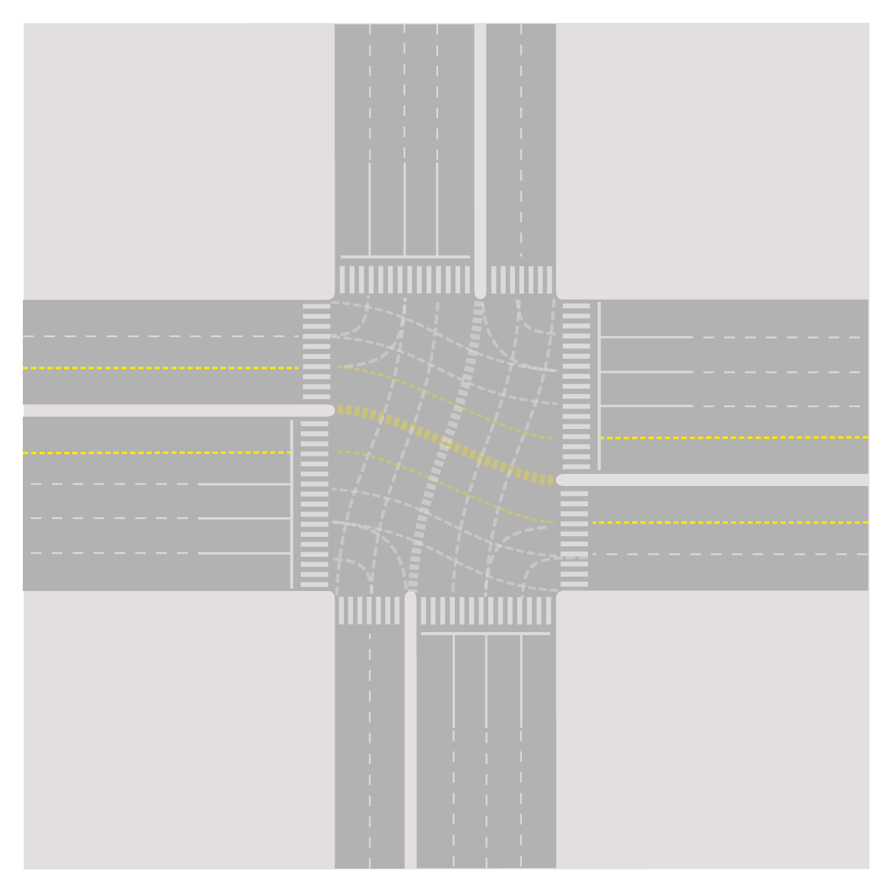
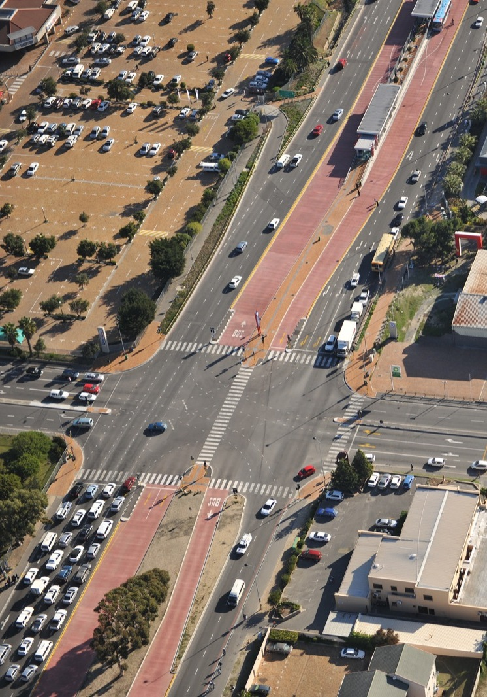

\startbox(narrowing-lanes)

###### Narrowing lanes

Narrowing lanes is a recognized traffic calming measure and a possible way to increase the intersection approach capacity. Even the saturation flow will be reduced in each lane, if one more lane can be squeezed in the stop line, capacity may increase and a better use of space for queueing is promoted.

Places where congestion is a serious issue may already have addressed regulation that allows using narrow measures, if not Public Works guidelines have to be changed.

US Federal Highway Administration suggests that, despite desired lane width of 3.6 metres to maximize flow, right-of-way or pedestrian needs may dictate use of a narrower lane width; lane widths bellow 2.7 metres are not recommended for new design, but in some very constrained retrofit situations on low speed roadways, lane widths as low as 2.4 m should be considered where appropriate (figure \fignum(montgomery-narrow-lane)).

\endbox

### Eliminating intersections

The extreme case of reducing phases would let only one phase, which would be equivalent to eliminate the intersection itself, clearly increasing capacity. 

Thus eliminating intersections along the busway seems at first a good idea. For median-side busway this can be provided by simply forbidding cross-traffic, while still allowing flow from transversal street join the mixed-traffic in the corridor to the kerb-side as in figure \fignum(quito-closed-cross) providing access to the corridor.

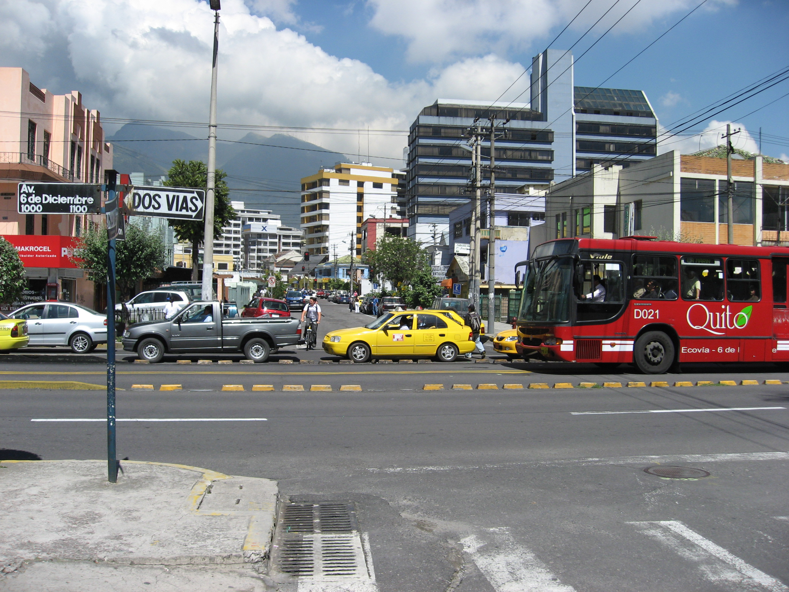

The flaw in adopting such extreme solution is that eliminating phases is based on diverting traffic demand for the excluded movements, so its movement can be done with other flows. Eliminating the movement (in this case, crossing the corridor) does not eliminates the demand for it; the movement has to happen somewhere else.

This measure indistinctly applied will reduce accessibility and concentrate demand in few locations (figure \fignum(permeability)). Before eliminating an intersection, it is necessary to understand which alternatives paths the demand will use to cross the corridor and compare the impacts of both situations: if the volumes are low or if the alternatives will not cause more delay to the BRT then it is really a good idea eliminate the intersection.

Eventually, creating new intersections, to split conflicting volume of one intersection into several is the needed strategy to increase green times for the BRT.

If there are no stations in the surrounding, then BRT vehicles can pass through several intersections at once if a synchronised signal system is used (see sections \sectionnumname(coordination) and \sectionnumname(passive-signal-priority)), however, when there is stations between intersections, the BRT vehicle will pass through the green phase at the first intersection and then stop at the station for passenger boarding and alighting. By the time the vehicle resumes movement towards the second intersection the signal phase may have changed to red (figure \fignum(BRT-fail-synchro)).

But when intersections are too close together in order to optimise the station location relative to them, an assessment has to be made in terms of how important the station location is for boarding and alighting passengers against the detour forced to mixed traffic to close the station and hindering the whole BRT system due to interference between the station and the intersection. There are three options:

1. Close one of the intersections: generating mixed-traffic detour time and higher cross volumes in other points that may impact the BRT corridor as well;
2. Transfer or remove the station: generating walking time for BRT users of that station;
3. Keep station and intersections: generating delay for all passengers in the BRT the pass through the intersection.

Even for normal mixed traffic, having two intersections too close together will sometimes lead to problems of the same nature of the discussed in sections \sectionnum(Minimum Recommended Distance between the BRT Station and the Intersection from mixed-traffic perspective and \sectionnum(Minimum Recommended Distance between the BRT Station and the Intersection from BRT perspective): vehicles queued at one intersection will back up to the point where vehicles are unable to clear the previous intersection during a green phase.

Equation \eqnum(dist-inters-mixed-traffic) bellow  defines the calculation for the distance above which this type of conflict shall not occur.

")

where:
D_i1-i2 = Distance in meters between intersection 1 and intersection 2;
T_green-i1 = Green signal time in seconds at intersection 1 
T_green-i2 = Green signal time in seconds at intersection 2 

A mixed traffic lane can generally handle 1,800 vehicles per hour.  This quantity translates to two vehicles per second (3,600 seconds in an hour).  When vehicles are stopped at a stop light, the average amount of space they take up is 6 metres; this space includes the vehicle and some space between vehicles.  This average vehicle distance means that for each second of time, 3 metres of vehicle-equivalents can be moved through the intersection.  

This distance between the intersections guarantees that there is enough space to queueing vehicles, so that it does not happens that the green light is open and there the vehicles are stuck in the upstream traffic light. Proper synchronization can reduce this distance practically to zero.

###### Example

The following scenario is outlined in order to determine whether two intersections apart 100 metres from each other  will result in free-flow operation or in congestion:

D_i1-i2 = 100 metres;
T_green-i1 = 40 seconds; 
T_green-i2 = 30 seconds.

To determine if the distance between these intersections is sufficient,equation  \eqnum(dist-inters-mixed-traffic)can be applied:

100 >= 3 * Max (40,30) 
100 >= 120  <-- FALSE

Since 100 metres is less than the required 120 metres, there is not enough space between the intersections. 

In the direction from 1 to 2 it is possible (if 2 is red while 1 is green) that vehicles queuing at 2 will back-up onto the first intersection and the last 20 metres of queue will be trapped before intersection 1. 

In the direction from 2 to 1 it is possible (if 1 green start the same time the first vehicle from 2 arrives at the intersection) that the last 10 seconds of green in 1 will be useless, since vehicles stop flowing after 30 seconds  in intersection 2.

### Shortening and eliminating phases

In this subsection we propose names for the traffic diversion models and traffic sign phase schemes as we describe them, in order to refer to them in the following text and in the next subsection. This names are not universally known references.

#### Typical 4-phases-intersection

In a typical intersection that allows all movements (figure \fignum(twelve-moves)), four phases are required; usually each origin has its phase ("standard-four-phases") but an alternative scheme with one phase for each direction (two ways) straight movement and kerbside-turns and one phase for each direction (two ways) cross-traffic turn may be used as well, which we will refer as "javanese-phases".

The standard configuration has the advantage of not requiring dedicated queue space (queue box) for cross-traffic turns and also allow sharing one lane for cross-turn and straight movements (it can be the most median-side or the second close to it) and let the intensity of the flows variations along the day balance the use of this lane. The javanese phases are interesting when cross-traffic-turn flows are relatively low and straight movements are intense in both ways (cross-traffic-turn phase will be short and straight will be long). Our practical experience suggests that javanese tends to be better if a clear bi-directional flow exists, but it ultimately requires an assessment of the flows intensity to each application.

A composition of the two is also possible, using cross-traffic-turn phase for one direction, and one phase per origin in the other direction ("mixed-four-phases").

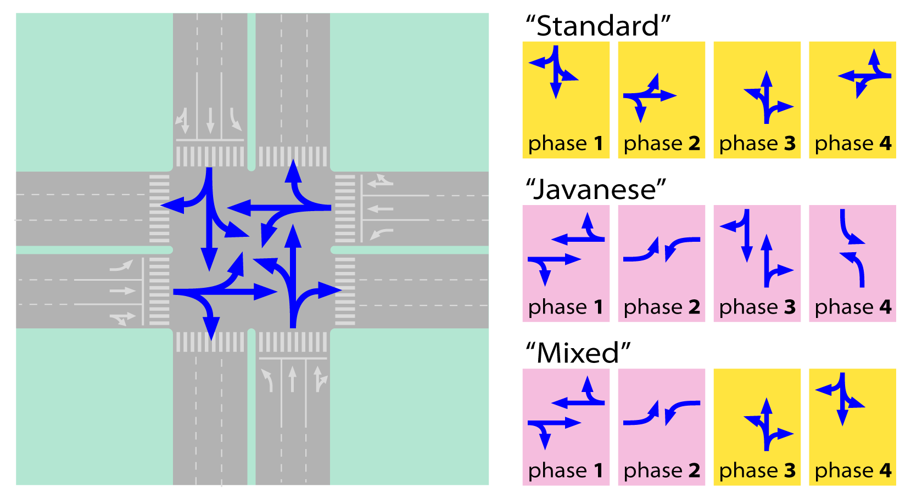

#### Movements conflicting with BRT

When the BRT has to cross a typical four-staged intersection, the main concern is to increase the green time for the corridor direction. Eliminating phases are likely to be very effective in doing so, but it is important to keep in mind that it is not the primary goal. Eliminate phases in a way that green time is not increased for the BRT approaches will improve only mixed-traffic performance.

To eliminate the phases we must focus in the **movements that conflict with the BRT** (figure \fignum(conflicting-movements)) and try to reroute them in a form such that they can cross the corridor all in one phase and briefly, i.e., providing width to the crossing movements approaches. Providing width to parallel movements is important to improve general traffic, which is also desirable, but not paramount.

For the reminder of the section we will assume that the bus way is median-side aligned and that the busway cross the intersection straight; if the busway is kerb-sided and/or it is turning between perpendicular roads, the same reasoning can be followed and the same alternatives for detour mixed-traffic movements shall be considered, but in a different and appropriated way.

With a median-side BRT, standard-four-phase sign can no longer be applied; once it will conflict for the cross-traffic turn (\fignum(quito-cross-front)), so the javanese or the mixed-four-phases has to be used.

 in a four-stage signal, cross-traffic-turn from the same direction need to have own phase. Image courtesy of Elebeta.")

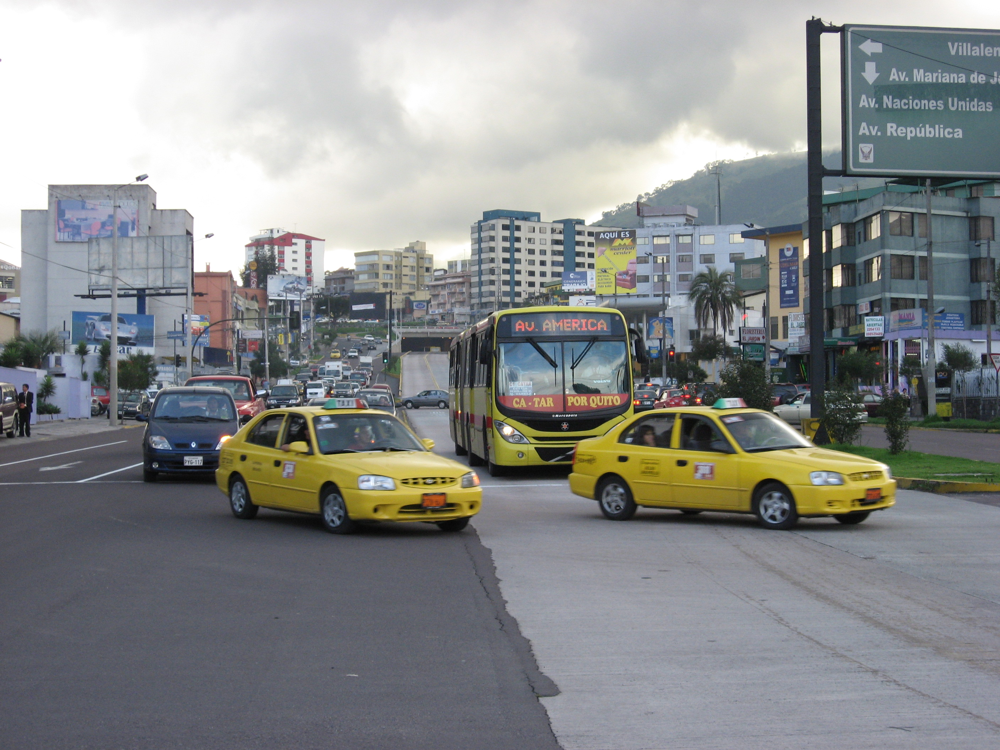 

#### Diverting kerb-side-turns

Diverting kerb-side-turns do not remove a phase, but it can free space for queueing and increase capacity for the remaining movements.

Moving kerb-side-turns away from the intersection is usually simple if parallel streets are available (figure \fignum(detour-kerb-side), it will require a cross-traffic turn in the parallel streets corner, which may start to spread the main corridor intersection problems to a broader area.  Detouring the kerb-side flow from the crossing street is particularly interesting because it can leave the whole approach width available to the conflict movements, reducing the crossing time (red for the corridor) in the same proportion this kerb-side-turn flow is to the total flow, even if four-phases are in use (figure \fignum(shorter-four-phase)). From the BRT point of view, there is no interest in divert the parallel kerb-side flow at the intersection, as it is not a conflicting movement.

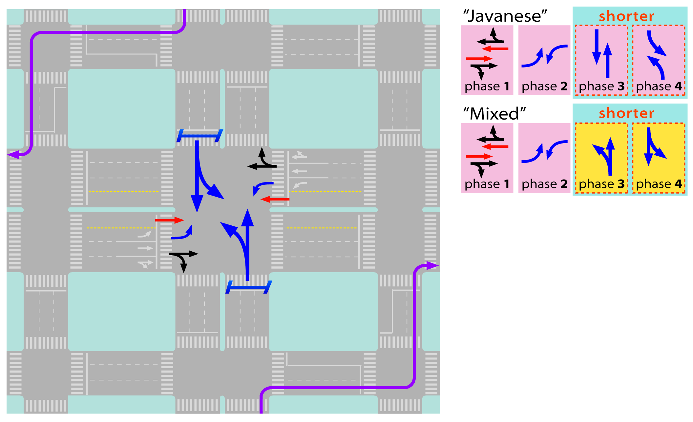

#### Diverting cross-traffic-turns

There are several ways of eliminating cross-traffic turns in the main intersection by detouring the flow. These can be applied both to the flows parallel to the corridor and to the flows crossing the corridor (and turning parallel to it). Without cross-traffic-turns, the intersection can have only two phases, but applying a detour to only one direction (both ways) means eliminating one phase already.

###### kerb-side-turn, cross-traffic-turn and cross-traffic-turn ("kerb-first")

This detour follows along with kerb-side detour proposed through auxiliary streets, with a kerb-side turn at the parallel  street before the intersection, followed by two successive cross-traffic-side turns (figure \fignum(detour-kerb-first)). This variation is certainly more interesting to be applied to the corridor perpendicular to the BRT, as it frees width in the its main approach to straight flow only. Comparing with other alternatives (discussed bellow) for application to the parallel flow to the BRT it might be an advantage to the mixed traffic that is not likely to benefit th BRT as it may justify reduction of proportional green time in BRT's direction.

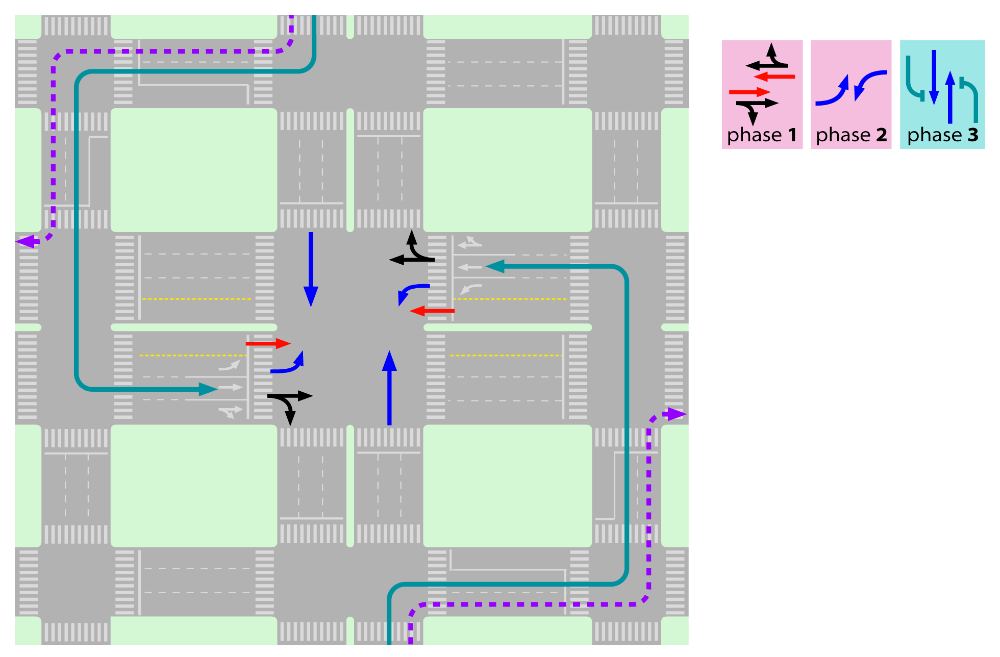 

###### Loop

After straight crossing the intersection, the willing to cross-traffic-turn flow has to do three kerb-side turns and then straight cross the intersection again (figure \fignum(loop-detour) shows an application to the flow initially parallel to the BRT), this has the clear disadvantage of using the intersection twice. Even other can be better, this alternative is always interesting for the BRT crossing flow, because it necessarily reduces red times. For the parallel flow it is interesting while flows are low enough not to take one lane width on the crossing-BRT phase.

 
###### Previous cross-turn ("previous cross")

Before reaching the main intersection, the diverted flow is allowed to cross-traffic turn in a location where there is no perpendicular crossing traffic (i.e. where previously no crossing intersection existed), the opposite straight flow has to be detained to allow this move, but it can be stopped synchronously to the main intersection. After the cross, the diverted flow follows perpendicular to the main corridor until a suitable location for a kerb-side-turn is reached; from there it will to go parallel to the original flow in direction to another intersection in the crossing road, downstream the main intersection, where it will join the flow by means of another cross-traffic flow in a two-stage traffic light (where previously no crossing existed or now has to be forbidden) also synchronized with the main intersection (figure \fignum(previous-turn)).

The "previous cross" detour is the best alternative for the parallel flow to the BRT corridor that wants to cross-traffic turn on the main intersection because it definitely moves the conflict away from the most crowded intersection. But it cannot be applied in both directions (parallel and perpendicular) as it would require a three phase intersection for exiting/returning to the main avenues. It also may create capacity conflict if, in the perpendicular direction of approach, kerb-side-turn is being diverted, so consideration about redirect it back regular kerb-side turning at the intersection shall be made. If, also in the perpendicular direction, cross-traffic-turn is diverted by means of "kerb-side-first" seriou conflict would rise, so the perpendicular flow shall be redirected to a "loop".

The previous cross alternative is similar in concept to the called "displaced left-turn" intersection in the US (figure \fignum(displaced-left-turn), which can be applied where width is available.

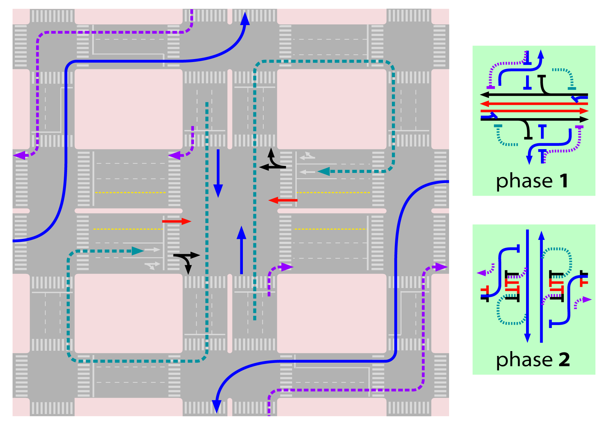

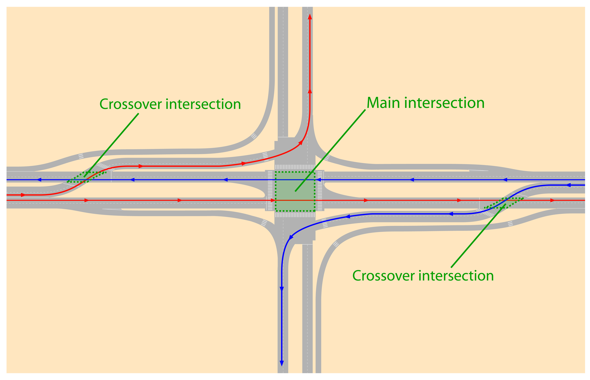

###### Kerb-side-turn and u-turn ("kerb-u")

Cross-traffic-flow detour is made by means of a kerb-side turn at the crossing road, followed by a u-turn in the crossing road at a suitable location approximately one hundred meters from the major route and then straight crossing the intersection. From the main intersection capacity point of view, this alternative has no advantage over the loop as it takes away the same width as the loop in both approaches. It is suitable when the loop is not an option, because the alternative is already congested or too long that would create political problems with car-drivers; besides there would have to be sufficient width to accommodate the u-turn as well as length for a waiting area. To be applied to the traffic coming from perpendicular direction to the BRT, as this movement crosses the bus lanes, undesirable conflicts are created for the BRT system. The u-turn traffic light shall be two-phase only, synchronized with the main intersection.

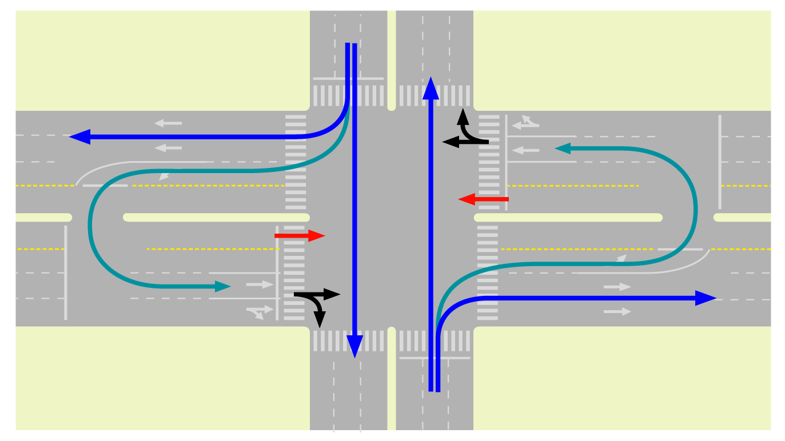

###### U-turn and kerb-side-turn ("u-kerb")

Another alternative of detour is possible by means of a u-turn at a median break downstream of the crossing road, followed by a right turn at the crossing road. (Figure \fignum(u-kerb)).

U-turn and queue area may be accommodated at the kerb-side instead of in the median side, as shown in figures
\fignum(side-u-kerb),\fignum(guangzhou-dongpu-uturn) and \fignum(guangzhou-dongpu-layout) where it accommodates cross-side-turn detoured flows both the parallel and perpendicular streets: parallel doing u-turn then kerb-side, the perpendicular doing kerb-side then u-turn.

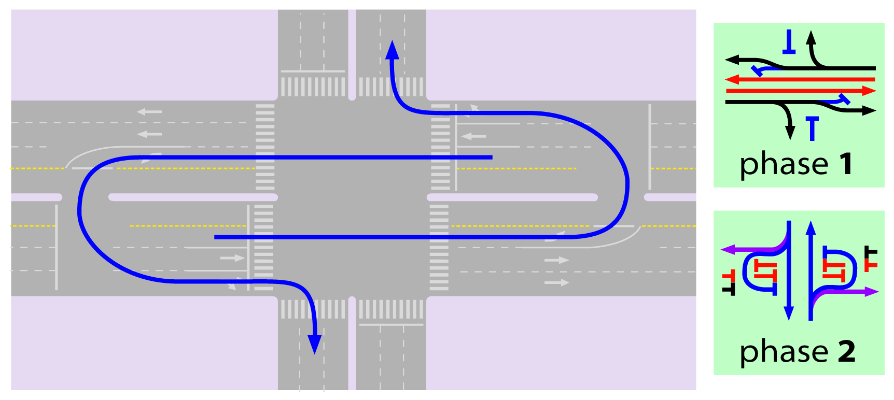

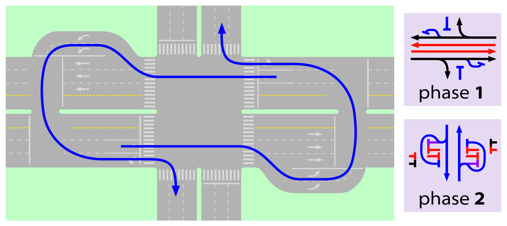

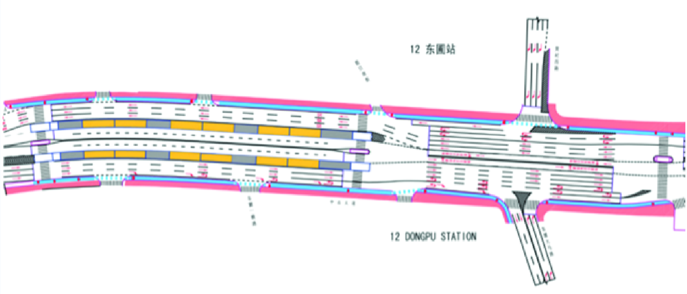

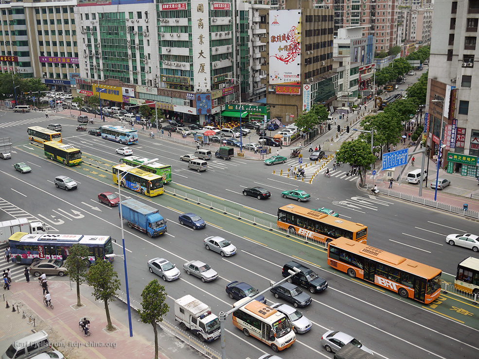

#### Diverting straight flow

###### Parallel street

The use of the imediate parallel street in one-way as an auxiliary street is an effective alternative for mixed-traffic. Even a narrow two-way street transformed into one-way street with parking prohibition can be a meaningful alternative for straight traffic and avoid the need for widening and expropriation. Applied both to BRT corridor and the corridor crossing, it can alleviate intersections. In São Paulo it is common that the "auxiliary" street end up having higher through put than the main corridor (figure \fignum(sp-9-julho+aux)).

 has higher mixed-traffic capacity than the main corridor (right) in São Paulo. Image from Google Maps.")

###### Move cross or u-turn away from the intersection

If the station location is seen as imperative, the intersection could be closed in order to avoid problems with the BRT system operation. Mixed traffic can be detoured around it. The examples for kerb-side and u-turn (figures \fignum(guanzhou-dongpu-station), \fignum(guangzhou-dongpu-uturn) and \fignum(gunagzhou-dongpu-layout)) applied this detour to straight movements too, although it its not surrounding the station.

), provides at-grade station access at both ends, combined with mixed traffic u-turns. Photo by Karl Fjellstrom")

### Creating two phases intersections

Many of the explored detour options assume/presume that an adjacent secondary-street system exists and has the capacity to absorb additional traffic caused by the proposed diversions. When they don't exist widening one of the roads to accommodate u-turns and/or previous cross-traffic-turn is usually a more feasible alternative.

Deciding which detour alternatives applies to each flow, requires a careful evaluation of the intensity and fluctuations of demand along the day in the intersection and surrounding streets, widths of the approaches and widening possibilities.

An infinity of compositions exists, including roundabouts and hamburger-shaped intersections and other are to be created. **The goal is to increase the proportion of green time given for the corridor direction**, capacity increasing for mixed traffic shall naturally result from this. 

**Alternatives that invert the way, i.e. making a right-handed system in a location where left-hand system is used or vice-versa, should not be proposed** (in our experience, even if the flow is completely channelled and pedestrians and bicycle crossings are grade-separated, there should be safer alternatives). The common situation of a flowing busway amidst congested mixed traffic is enough potential danger to deal with at the intersection. The importance of enforcement policy to BRT drivers slow down in this situation cannot be stressed enough.

Specially for mixed traffic, measuring travel time alone is not the right metric to evaluate and monitor the quality of solution. It is very likely (and frustrating) one will see congestion returning after a fine implementation is in place on a major intersection. When that happens, one must remember that, besides accommodating rapid public transport, the capacity gains for mixed traffic. Congestion seems to be the only general traffic deterrent, so a good design will enable more people to cross the intersection area by car, that might mean that either travel times or congestion were eliminated somewhere else or that more people are willing to come to that area and benefit from the activities that part of the city has to offer.

When the adjacent land use is primarily residential, there is likely to be considerable resistance to the above proposals. One may keep in mind that is a normal pressure of city growth (historically, cities grows out of road intersections), and a broader perspective to regulate the use of land might be brought into the project.

### Comparison examples

For an initial general analysis of the possible configuration, we graphically present the cycle time as a function of of required relative green times for vehicular phases (figure \fignum(cycle-times)). We consider both the situation where a pedestrian phase is required and not; when required, we assume the pedestrian phase will need 10 seconds plus 4 seconds of clearance, that is time for crossing 3 lanes. The clearance (or lost time) for each phase is 4 seconds as well.

 cycles required get too long very quickly. Chart by courtesy of Elebeta.")

By observing the chart, it is clear that when  pedestrian crossing phase is present by the time green times are required to be 75%, the intersection is near to collapse, this threshold is between 80% and 85% if no pedestrian phase is required.

The chart also shows, that increasing cycles beyond 120 seconds is not efficient in any situation, in the best case (4 vehicular phases plus pedestrian phase), by increasing it to 150 seconds (+25%) results in a 5% increase in capacity, raising it to 300 seconds will add more 10% capacity. Such a desperate measure will of course prevent queueing formation during peak hour and that certainly reduces travel times, but other measures can be for sure much more efficient.

If the BRT-users, that will not be stuck in traffic, delay is computed equally to the car-users it is very likely that raising cycle times above 120 seconds will result in overall time losses. Further more, if kerb-side turns are detoured or refuge islands as discussed in section \sectionnum(integrating-pedestrians-and-cyclists-movements), a proper set of two-phase signal will not require pedestrian only phase. In such situation cycle times above 60 seconds are likely to be useless, above 90 seconds are certainly not justifiable. As seen in section \sectionnum(station-location-in-relation-to-intersection), short cycles greatly reduces the chances of spillbacks on the busway hindering stations.

For comparison of different configuration impacts, we will assume a very symmetric four-leg intersection, where the flow from each origin is equal and the left and right turns each represent 25 percent of traffic movements, straight represents 50 percent and there is no u-turn demand. We will also assume a three lane approach for mixed-traffic in each leg as previous figures in this section shows, with  saturation capacity flow rate of 1800 pcu/hour. When required, only one lane is used for cross-traffic-turn per approach. We maintain the same assumptions to draw the chart regarding clearance times (4 seconds per phase change) and pedestrian phases (14 seconds per phase when phase required, and we assume it is not required in two-phases intersections)

###### typical four-phases intersection

For comparing four-phases intersection, we will fix cycle time in 120 seconds (2 minutes) and evaluate the effect of green time for the straight flow in one of the directions considering detouring kerb-side-turns for each direction (two ways), and overall capacity of the intersection divided by the number of lanes approaching it (N_lanes in our example is 12); results are in table \tablenum(four-phases capacity example).

\table(Four-phases Capacity Examples)

|cycle time (seconds)| phases |direction 1 kerb-side-turn|direction 2 kerb-side-turn|direction 1 straight movement green time (seconds)| average lane capacity (pcu/hour)|
|-------|----------|-----------|------------|------------|----------
|120|standard|-      |        |23|338
|120|javanese|-      |  -	  |31|416
|120|standard|detour |	-	  |19|338
|120|javanese|detour |	-	  |23|404
|120|standard|-	     |	detour|26|338
|120|javanese|-	     |	detour|35|404
|120|standard|detour |	detour|23|338
|120|javanese|detour |	detour|26|390

Under the proposed scenario, a "standard-four-phase" signal has 90 seconds to distribute among the phases (30 out of 120 seconds are for pedestrian plus clearance times of phases changes), so it means 22.5 seconds per phase (rounded to 23 in the table) in the symmetrical situations. By detouring away kerb-side turns to one side only (letting only 75% of demand to be served), 3 seconds can be removed from the lesser demanded phases and passed to the other two (19 and 26 seconds); the capacity of each lane of each approach is aways equal meaning that overall 4050 vehicles could pass through the intersection in one hour in the 12 lanes (= 338 x 12).

In comparison, the "javanese phases", which do not require a pedestrian phase, can distribute 104 seconds among the phases, and it end being 31 for the straight and 21 for the cross-traffic turn (this last information is not on the table but is deductible). If lanes could be used in fractions, then allocating 3/4 of a lane to cross-traffic-turns would lead to balanced situation of 26 seconds of green time to each phase, which is the case when both kerb-side-turns are removed from the intersection.

On the balanced situation, when the javanese phases have the lowest capacity, they still have the same capacity as the standard phases, the higher throughput being consequence only of the absence of the pedestrian-only phase. As a general rule, javanese phases are more efficient than standard phases. Mixed phases result are not shown, they are in between, closer to standard as they require pedestrian phases too.

###### Reducing number of phases effects

The previous discussion about four phases intersection lay out grounds for not considering the "mixed-four-phases" alternative in the following examples and a reason why there is no need to present previous cross-traffic turn, interlacing the BRT lane and mixed-traffic (figure \fignum(fly-over-conflict)) to place mixed traffic on the median-side in a position to allow a standard-four-phases intersection to work where no other alternative is possible: the javenese-phases signal works better.

To compare the effects of alternative schemes for phase reduction, we will consider a 90 seconds cycle time without pedestrian-only phase, but with an additional BRT lane in one direction in the median-side (also as shown on figures on this section). The resulting green time to the BRT for each alternative is shown, besides intersection capacity to mixed-traffic in the table \tablenum(increasing-capacity-examples), where:
- average lane capacity: the average of the mixed-traffic lanes capacity that would be measured at the stop lines approaching the main intersection;
- overall intersection capacity per lane: in certain configurations, some vehicles pass through two stop lines in order to execute their turning movements, this measure would be similar to the above, except that it does not count the second passage of the same vehicle.
- total throughput with auxiliary intersections per lane at intersection: this adds the flows that were completely diverted away from the main intersection (kerb-side-turn detour and previous cross-traffic-turn detour) as if they were effectively passing through the intersection. By bringing the value to the number of lanes of the intersection, this presents a practical estimative of how much the capacity of the main intersection can be pushed to benefit from using the auxiliary ones.

\table(Increasing Capacity Examples)

|option | cycle time (seconds) | phases| BRT direction kerb-side-turn detour| BRT direction cross-traffic-turn  detour| perpendicular direction kerb-side-turn detour| perpendicular direction cross-traffic-turn  detour| figure | BRT green time (seconds) | average lane capacity (pcu/hour) | overall intersection capacity per lane (pcu/lane) | Total throughput with auxiliary intersections per lane at intersection
|---|------|--------|--------------|--------------|--------------------|-----------------|-----------------------------------------------------------|-----------|-----------------|------------------------------|------------------------
|A| 90| javanese| -| -| -| -| \fignum(conflicting-movements)| 22| 395| 395| 395
|B| 90| javanese| detour| -| -| -| | 16| 384| 384| 439
|C| 90| javanese| -| -| detour| -| \fignum(detour-kerb-side)| 25| 384| 384| 439
|D| 90| javanese| detour| -| detour| -| | 19| 370| 370| 493
|E| 90| 3| -| -| detour| kerb-first| \fignum(detour-kerb-first)| 43| 496| 496| 567
|F| 90| 2| -| loop| detour| kerb-first| \fignum(loop-detour)| 51| 819| 716| 819
|G| 90| 2| -| Previous-turn| detour| loop| \fignum(previous-turn)| 47| 819| 702| 936
|H| 90| 2| -| -| -| loop| | 41| 819| 716| 819
|I| 90| 2| detour| kerb-first| detour| kerb-first| | 41| 819| 819| 1092
|J| 90| 2| -| loop| -| loop| | 41| 819| 655| 655
|K| 90| 2| detour| loop| detour| loop| “clove like”| 41| 819| 614| 819
|L| 90| 2| -| u-kerb| -| kerb-u| \fignum(u-kerb) and \fignum(side-u-kerb)| 49| 819| 655| 655
|M| 90| 2| -| kerb-u| -| u-kerb| | 33| 819| 655| 655

In our scenario, detouring all kerb-side-turns away implies that 25% of cars are not using the approaching lanes to the intersection, and 75% of them are. So for each vehicle at intersection there is more a third outside, this means 33% increase in "intersection capacity".

In comparison with the four-phases (javanese) signal, even three-phases signal implies in considerable increase of green-time to the BRT. While reducing from 4 to 3 phases a considerable increase of 25% for the capacity at the intersection (and 50% considering auxiliaries intersections) with satisfactory relative green time near 50%, from the point of view of mixed-traffic throughput, the reduction from 4 to 2 phases represent in the worst cases (u-turn alternatives and only loops: J, L and M) 80% of increase for the throughput at the intersection and 107% at the intersection in the best alternative (option I) while green times are in the same range (except for alternative M, that uses u-turns at the perpendicular street). To implement a two-phases signal is clearly the best thing to do.

A two-phase traffic signal, when balanced to serve the demand will result (for this very common situation of 90 seconds cycle and 4 seconds of clearance) in the capacity of 820 pcu/hour, if all willing to turn flow is placed on the (kerb-sided) parallel streets on both directions (option I), one can reach an equivalent of 1092 pcu/hour, which is 60% of an uninterrupted lane capacity (as an average for two directions, likely to represent 75% of the average of the best grade-separated solution and be better than many graded-separated solutions, see section sectionnum(restricting-turning-movements-together-with-grade-separation) ) and 320% the average capacity of a standard four-phase intersection. Clearly, the consideration of the detour alternatives to reduce signal phases can do a lot to increase green time for the corridor as well as capacity for mixed-traffic.

