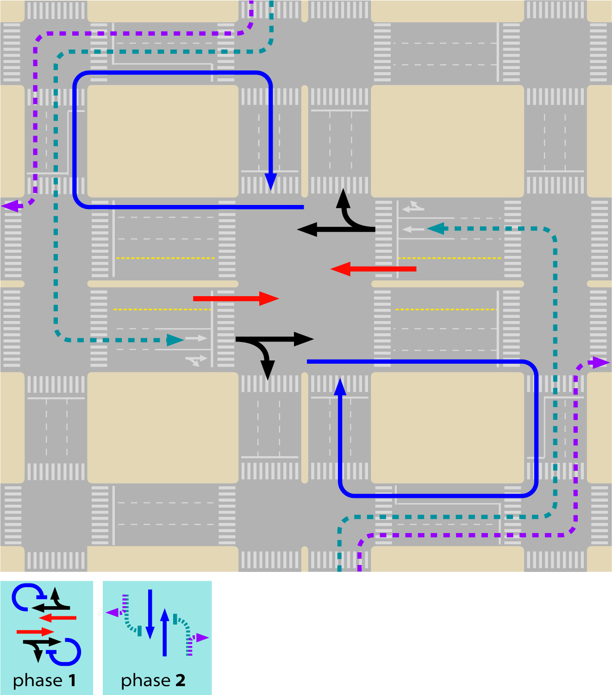

 ## Restricting General Traffic Turning Movements

**"No matter how many times you save the world, it always manages to get back in jeopardy again. Sometimes I just want it to stay saved! You know, for a little bit? I feel like the maid; I just cleaned up this mess! Can we keep it clean for... for ten minutes!"** - Mr. Incredible, "The Incredibles" animation movie character, 2004

The overall capacity of the intersection is given by the sum of the capacity of each approaching lane. By its turn, the capacity of each approaching lane is given by the sum of saturation flow of the lane multiplied by the sum of relative green times of the phases the lane is active.

No matter how many phases there is on the traffic light, the sum of relative green for all vehicular phases with relative lost time is constant (if there was no pedestrian phases, it would be equal 1). The initial step to programming traffic lights is divide this fixed amount among the phases. With the general assumptions that a movement not allowed during a given phase will block a lane and that the saturation flow per lane is the same (for turning it can be lower): for any given signalized intersection, if a phase is removed (therefore the movements of that phase) and the green time and approaches for the movements of the removed phase are incorporated into another phase the overall capacity of the intersection will necessarily increase.

This is empirically clear for a relatively balanced intersection, a larger number of phases in a traffic light means waiting longer and having a lower share of green time.

Of course it is not interesting to create capacity for movements without demand, the following subsections will discuss alternatives to divert traffic in order to increase capacity by eliminating phases. We will see that in some cases, intersection capacity still is increased even if the demand for eliminated movements, namely cross-traffic turns are forced to pass over the intersection twice.

Widening the intersection can be of great assistance, but rarely to the point it can achieve the same benefits of reducing phases from four to two. If widening is possible, it shall be done in order to reducing the number of phases to two.

\startbox(narrowing-lanes)

###### Narrowing lanes

Narrowing lanes is a recognized traffic calming measure and a possible way to increase the intersection approach capacity. Even the saturation flow will be reduced in each lane, if one more lane can be squeezed in the stop line, capacity may increase and a better use of space for queueing is promoted.

Places where congestion is a serious issue may already have addressed regulation that allows using narrow measures, if not Public Works guidelines have to be changed.

US Federal Highway Administration suggests that, despite desired lane width of 3.6 metres to maximize flow, right-of-way or pedestrian needs may dictate use of a narrower lane width; lane widths bellow 2.7 metres are not recommended for new design, but in some very constrained retrofit situations on low speed roadways, lane widths as low as 2.4 m should be considered where appropriate (figure \fignum(montgomery-narrow-lane)).

\endbox

### Eliminating intersections

The extreme case of reducing phases would let only one phase, which would be equivalent to eliminate the intersection itself, clearly increasing capacity. 

Thus eliminating intersections along the busway seems at first a good idea. For median-side busway this can be provided by simply forbidding cross-traffic, while still allowing flow from transversal street join the mixed-traffic in the corridor to the kerb-side as in figure \fignum(quito-closed-cross) providing access to the corridor.

The flaw in adopting such extreme solution is that eliminating phases is based on diverting traffic demand for the excluded movements, so its movement can be done with other flows. Eliminating the movement (in this case, crossing the corridor) does not eliminates the demand for it; the movement has to happen somewhere else.

This measure indistinctly applied will reduce accessibility and concentrate demand in few locations (figure \fignum(permeability)). Before eliminating an intersection, it is necessary to understand which alternatives paths the demand will use to cross the corridor and compare the impacts of both situations: if the volumes are low or if the alternatives will not cause more delay to the BRT then it is really a good idea eliminate the intersection.

Eventually, creating new intersections, to split conflicting volume of one intersection into several is the needed strategy to increase green times for the BRT.

If there are no stations in the surrounding, then BRT vehicles can pass through several intersections at once if a synchronised signal system is used (see sections \sectionnumname(coordination) and \sectionnumname(passive-signal-priority)), however, when there is stations between intersections, the BRT vehicle will pass through the green phase at the first intersection and then stop at the station for passenger boarding and alighting. By the time the vehicle resumes movement towards the second intersection the signal phase may have changed to red (figure \fignum(BRT-fail-synchro)).

But when intersections are too close together in order to optimise the station location relative to them, an assessment has to be made in terms of how important the station location is for boarding and alighting passengers against the detour forced to mixed traffic to close the station and hindering the whole BRT system due to interference between the station and the intersection. There are three options:

1. Close one of the intersections: generating mixed-traffic detour time and higher cross volumes in other points that may impact the BRT corridor as well;
2. Transfer or remove the station: generating walking time for BRT users of that station;
3. Keep station and intersections: generating delay for all passengers in the BRT the pass through the intersection.

Even for normal mixed traffic, having two intersections too close together will sometimes lead to problems of the same nature of the discussed in sections \sectionnum(Minimum Recommended Distance between the BRT Station and the Intersection from mixed-traffic perspective and \sectionnum(Minimum Recommended Distance between the BRT Station and the Intersection from BRT perspective): vehicles queued at one intersection will back up to the point where vehicles are unable to clear the previous intersection during a green phase.

Equation \eqnum(dist-inters-mixed-traffic) bellow  defines the calculation for the distance above which this type of conflict shall not occur.

")

where:
D_i1-i2 = Distance in meters between intersection 1 and intersection 2;
T_green-i1 = Green signal time in seconds at intersection 1 
T_green-i2 = Green signal time in seconds at intersection 2 

A mixed traffic lane can generally handle 1,800 vehicles per hour.  This quantity translates to two vehicles per second (3,600 seconds in an hour).  When vehicles are stopped at a stop light, the average amount of space they take up is 6 metres; this space includes the vehicle and some space between vehicles.  This average vehicle distance means that for each second of time, 3 metres of vehicle-equivalents can be moved through the intersection.  

This distance between the intersections guarantees that there is enough space to queueing vehicles, so that it does not happens that the green light is open and there the vehicles are stuck in the upstream traffic light. Proper synchronization can reduce this distance practically to zero.

###### Example

The following scenario is outlined in order to determine whether two intersections apart 100 metres from each other  will result in free-flow operation or in congestion:

D_i1-i2 = 100 metres;
T_green-i1 = 40 seconds; 
T_green-i2 = 30 seconds.

To determine if the distance between these intersections is sufficient,equation  \eqnum(dist-inters-mixed-traffic)can be applied:

100 >= 3 * Max (40,30) 
100 >= 120  <-- FALSE

Since 100 metres is less than the required 120 metres, there is not enough space between the intersections. 

In the direction from 1 to 2 it is possible (if 2 is red while 1 is green) that vehicles queuing at 2 will back-up onto the first intersection and the last 20 metres of queue will be trapped before intersection 1. 

In the direction from 2 to 1 it is possible (if 1 green start the same time the first vehicle from 2 arrives at the intersection) that the last 10 seconds of green in 1 will be useless, since vehicles stop flowing after 30 seconds  in intersection 2.

### Eliminating movements

#### Typical 4-phases-intersection

In a typical intersection that allows all movements (figure \fignum(twelve-moves)), four phases are required; usually each origin has its phase (figure \fignum(typical-four-phases)) but an alternative scheme with one phase for each direction (two ways) straight movement and kerbside-turns and one phase for each direction (two ways) cross-traffic turn may be used as well (figure \fignum(cross-traffic-four-phases)).

The typical configuration has the advantage of not requiring dedicated queue space (queue box) for cross-traffic turns and also allow sharing one lane for cross-turn and straight movements (it can be the most median-side or the second close to it). The scheme with phases for cross-traffic-turn only are interesting when its flows are relatively low and straight movements are intense in both ways (cross-traffic-turn phase will be short and straight will be long)

A composition of the two is also possible, using cross-traffic-turn phase for one direction, and one phase per origin in the other direction (figure \fignum(mix-typical-and-cross-turn)).

#### Movements conflicting with BRT

When the BRT has to cross a typical four-staged intersection, the main concern is to increase the green time for the corridor direction. Eliminating phases are likely to be very effective in doing so, but it is important to keep in mind that it is not the primary goal. Eliminate phases in a way that green time is not increased for the BRT approaches will improve only mixed-traffic performance.

To eliminate the phases we must focus in the **movements that conflict with the BRT** (figure \fignum(conflicting-movements))and try to reroute them in a form such that they can cross the corridor in one phase and briefly, i.e., providing width to the crossing movements approaches. Providing width to parallel movements is important to improve general traffic, which is also desirable, but not paramount.

For the reminder of the section we will assume that the bus way is median-side aligned and that the busway cross the intersection straight; if the busway is kerb-sided and/or it is turning between perpendicular roads, the same reasoning can be followed and the alternatives for detour mixed-traffic movements shall be considered, but in a different and appropriated way.

 conflicting movements(in blue) shall be addressed. Image courtesy of Elebeta.")

With a median-side BRT, typical four-phase stage can no longer be applied; once it will conflict for the cross-traffic turn (\fignum(quito-cross-front)), alternative cross-traffic turn stage has to be present in BRT direction (figures \fignum(four-phases-with-brt-one) and \fignum(four-phases-with-brt2)).

 in a four-stage signal, cross-traffic-turn from the same direction need to have own phase. Image courtesy of Elebeta.")

 in a four-stage signal, cross-traffic-turn from the same direction need to have own phase. Image courtesy of Elebeta.")

 the phases from other direction can still be one for each origin leg. Image courtesy of Elebeta.")

#### Diverting kerb-side-turns

Diverting kerb-side-turns usually do not remove a phase, but it can free space for queueing and increase capacity for the remaining movements.

Moving kerb-side turns away from the intersection is usually simple if parallel streets are available (figure \fignum(detour-kerb-side). Detouring the kerb-side flow from the crossing street is particularly interesting because it can leave the whole approach width available to the conflict movements, reducing the crossing time (red for the corridor) in the same proportion this kerb-side-turn flow is to the total flow, even if four-phases are in use (figure \fignum(shorter-four-phase)).

#### Diverting cross-traffic-turns

There are several ways of eliminating cross-traffic turns in the main intersection by detouring the flow. These can be applied both to the flows parallel to the corridor or to the flows crossing the corridor (and turning parallel to it). Without cross-traffic-turns, the intersection can have only two phases, but applying a detour to only one direction (both ways) means eliminating one phase already.

###### Loop

After crossing the intersection, the willing to cross-traffic-turn flow has to do three kerb-side turns and then cross the intersection again (figure \fignum(loop-detour)) this has the clear disadvantage of crossing the intersection twice. Even other can be better, this alternative is always interesting for the BRT crossing flow, because it necessarily removes red times. For the parallel flow it is interesting while flows are low (bellow 300-450 pcu/hour, i.e. not enough to take one lane width on the crossing BRT phase)

 
###### Kerb-side-turn and u-turn

Cross-traffic-flow detour is made by means of a right turn at the crossing road, followed by a u-turn in the crossing road at a suitable location approximately one hundred meters from the major route and then cross the intersection a second time. From the main intersection capacity point of view, this alternative has no advantage over the loop as it takes away the same width as the loop in both approaches. It is suitable when the loop is not an option, because the alternative is already congested or too long that would create political problems with drivers; besides there would have to be sufficient width to accommodate the u-turn as well as length for a waiting area.

###### U-turn and kerb-side-turn

By means of a u-turn at a median break downstream of the crossing road, followed by a right turn at the crossing road. As this movement crosses the bus lanes, undesirable conflicts may be created for the BRT system (Figure 24.8), though this configuration can be very successfully applied to BRT station access.

U-turn and queue area may me accommodated at the kerb-side instead of in the median side, as shown in figures
\fignum(guangzhou-dongpu-uturn) and \fignum(gunagzhou-dongpu-layout) where it accommodates cross-side-turn detoured flows both the parallel and perpendicular streets: parallel doing u-turn then kerb-side, the perpendicular doing kerb-side then u-turn.

###### kerb-side-turn, cross-traffic-turn and cross-traffic-turn

This detour follows along with kerb-side detour proposed through the auxiliary streets, with a kerb-side turn at the parallel  street before the intersection, followed by two successive cross-traffic-side turns. When comparing with the loop, this variation is certainly more interesting to be applied to the corridor perpendicular to the BRT, as it frees width in the its main approach to straight flow only. Still comparing with the loop for application to the parallel flow to the BRT it might be an advantage to the mixed traffic, that is not likely to benefit th BRT as it may justify reduction of proportional green time in BRT's direction.

###### Previous turn

Before reaching the main intersection, the flow is allowed to left turn in a location where there is no crossing traffic, so the straight flow is stopped synchronously to the main intersection. The flow follow parallel to the main corridor and turn kerb-side to go parallel to the original flow in direction to an intersection in the crossing road,downstream the main intersection, where it will join the flow by means of a two-stage traffic light (crossing from the opposite way has to be forbidden), also synchronized with the main intersection.

The previous cross-traffic-turn is the best detour alternative to apply to the parallel flow to the BRT corridor that wants to turn left on the main intersection. The idea is similar to the variant of kerb-side-turn and u-turn, but definitely moving the conflict away from the intersection.

This alternative is similar in concept to the called "displaced left-turn" in the US (figure \fignum(displaced-left-turn), which can be applied where width is available.

#### Diverting straight flow

###### Parallel street

The use of the imediate parallel street in one-way as an auxiliary street is an effective alternative for mixed-traffic. Even a narrow two-way street transformed into one-way street with parking prohibition can be a meaningful alternative for straight traffic. Applied both to BRT corridor and the corridor crossing, it can alleviate intersections.In São Paulo it is common that the "auxiliary" street end up having higher through put than the main corridor (figure \fignum(sp-9-julho+aux)).

 has higher mixed-traffic capacity than the main corridor (right) in São Paulo. Image from Google Maps.")

###### Force cross or u-turn away from the intersection

If the station location is seen as imperative, the intersection could be closed in order to avoid problems with the BRT system operation. Mixed traffic can be detoured around it. The examples for kerb-side and u-turn (figures \fignum(guanzhou-dongpu-station), \fignum(guangzhou-dongpu-uturn) and \fignum(gunagzhou-dongpu-layout)) applied this detour to straight movements too, although it its not surrounding the station.

 
### Creating two phases intersections

The explored detour option all assume/presume that an adjacent secondary-street system exists and has the capacity to absorb additional traffic caused by the proposed diversions. When they don't exist widening one of the roads to accommodate u-turns and/or previous cross-traffic-turn is usually a more feasible alternative.

Deciding which detour alternatives applies to each flow, requires a careful evaluation of the intensity and fluctuations of demand along the day in the intersection and surrounding streets, widths of the approaches and widening possibilities.

An infinity of compositions exists, including roundabouts and hamburger-shaped intersections and other are to be created. **The goal is to increase the proportion of green time given for the corridor direction**, capacity increasing for mixed traffic shall naturally result from this. 

**Alternatives that invert the way, i.e. making a right-handed system in a location where left-hand system is used or vice-versa, should not be proposed**(in our experience, even if the flow is completely channelled and pedestrians and bicycle crossings are grade-separated, there should be safer alternatives). The common situation of a flowing busway amidst congested mixed traffic is enough potential danger to deal with at the intersection. The importance of enforcement policy to BRT drivers slow down in this situation cannot be stressed enough.

Specially for mixed traffic, measuring travel time alone is not the right metric to evaluate the quality of solution, although it is very frustrating see congestion returning after a fine implementation is in place on a major intersection, one must remember the capacity gains. Congestion seems to be the only traffic deterrent, so a good design will enable more people to cross the intersection area by car, that might mean that either travel times or congestion was eliminated somewhere else or that more people are willing to come to that area and benefit from the infrastructure that part of the city has to offer.

When the adjacent land use is primarily residential, there is likely to be considerable resistance to the above proposals. One my keep in mind that is a normal pressure of city growth (historically, cities grows out of road intersections), and a broader perspective to regulate the use of land might be brought to the project.

###### Comparison example

Table \tabnum(compare-intersection-capacity) compares different configurations impacts to the overall mixed-traffic capacity of an intersection, to do so it assumes that flow rate is the same from all origins and that left and right turns each represent 25 percent of traffic movements (therefore straight represents 50 percent) and the treatment given for all approaches is the same. The relative green time for BRT assumes an additional busway in the middle lane, pedestrian only phase of 6 seconds and lost times of 4 seconds per phase

| option | phases | cross-traffic location | kerb-side turns    c | capacity per lane (pcu/hour per lane) |BRT relative green time 
|-----------|-----|----------------|-----------------|------------
| A | 4 | at intersection | at intersection | 450 | 20%
| B | 4 | at intersection | at intersection | 600 | 20%
| C | 2 | u-turn and kerb-side turn | at intersection | 760 | 40%
| D | 2 | loop after intersection | before intersection| 950 | 40%
| E | 2 | prior kerb-side-turn and two left-turns | 

