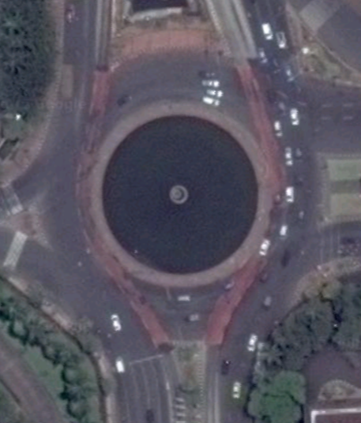
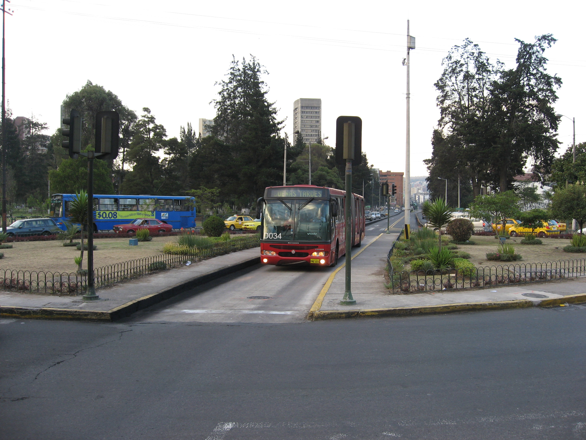
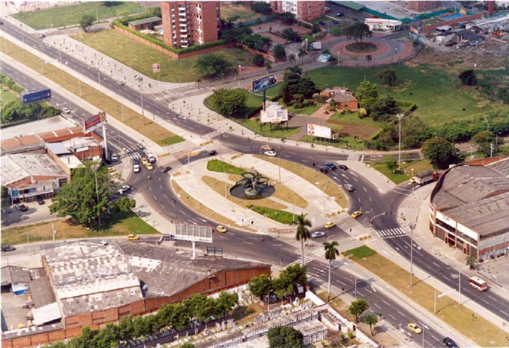

#[Intersections and traffic signals](toc.md#toc)

## BRT lanes at roundabouts

“So many roads. So many detours. So many choices. So many mistakes.”

	- 	Sarah Jessica Parker, actress, 1965 -

Intersections with roundabouts can create considerable uncertainty for the busway system. If the BRT vehicle must cross several lanes of mixed traffic within a heavily congested roundabout, the BRT vehicle may be hindered from proceeding.

However, there are some solutions to the difficulties posed by roundabouts. There are at least five distinct possibilities for accommodating BRT systems through a roundabout: 

1. mixed traffic operation;
2. mixed traffic operation with signalized waiting areas; 
3. exclusive lane along inside of roundabout
4. exclusive busway through the middle of the roundabout; 
5. grade separation.

###### Mixed-traffic operations:

If mixed traffic and BRT system volumes are not particularly heavy and/or if the roundabout has no traffic lights, then simply allowing the BRT vehicles to enter mixed traffic may be an effective and simple solution. In such cases, the BRT vehicle will leave the dedicated busway upon entering the roundabout, which may be either controlled through a traffic signal (eventually new traffic signal and/or activated by the vehicle approach) or left to operate on a yield priority basis.

###### Mixed-traffic operation with signalized waiting area:

In this situation, a standard intersection is converted to a roundabout with signalized control as described in the end of section \sectionnum(convert-cross-into-a-roundabout). When a standard intersection has reached its saturation point BRT only waiting areas shall be created And  private vehicles must be accommodated  in a variety of turning options already discussed.

###### Exclusive lane along the inside of a roundabout:

In cases where BRT and mixed-traffic volumes dictate that some priority must be retained for the BRT vehicles, then making the inside lanes of the roundabout exclusive to BRT can be an effective option (figure \fignum(transjakarta-roundbout)). In this case, the BRT vehicles can access the exclusive roundabout lanes either by crossing mixed-traffic lanes or by being given priority signalization. Likewise, to exit the roundabout and re-enter the principal busway, the BRT vehicle must cross mixed-traffic lanes. As with the entry to the roundabout, the BRT vehicle can either maneuver across mixed traffic to exit the roundabout, or another set of traffic signals can be used to facilitate the exit.

###### Exclusive busway through the middle of a roundabout:

Depending on the physical contents of the roundabout, a dedicated lane could be constructed through the center of the roundabout. In this case, the busway is built straight through the roundabout, while mixed traffic continues to circulate around it. Quito’s Ecovía line provides an example of this technique (figure \fignum(quito-thru-roundbout)).Likewise, the Cali, Colombia system makes use of this approach (figure \fignum(cali-thru-roundbout)). The ability to construct a dedicated lane through the center of the roundabout will only be feasible when the center area of the roundabout does not host a fountain, sculpture, or other permanent piece of urban infrastructure. The construction of the BRT system should not involve the loss of any items of cultural identity. In this design, a traffic signal controls movement through the roundabout.

###### Grade separation

This alternative is discussed at the section \sectionnumber(Grade Separation), where other aspects of graded-separated solutions are presented.

