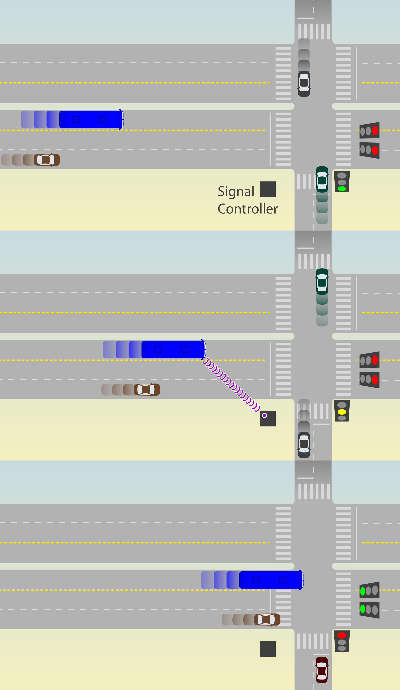
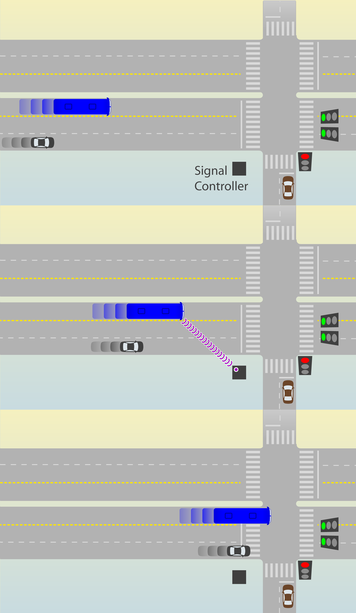

#[Intersections and traffic signals](toc.md#toc)

## Traffic signal priority

Signal priority for BRT vehicles is the adjustment of traffic signals to give priority to a corridor with a BRT system over a corridor without one, and to give priority to the BRT system over mixed traffic within the same corridor. Once equipment and techniques were developed to do this in a responsive way after the detection of BRT vehicles approaching an intersection, the expression "active signal priority" became the way to indicate this advance. Since then "passive signal priority" is used to let clear that such detection technology is not being applied.

### Passive signal priority

Together with signal phase simplification, passive signal priority is material for proper BRT intersection design and the two techniques are complementary and must be considered jointly for implementation.

Prioritisation is primarily achieved by extending the relative green time for the BRT corridor over the crossing streets that do not have public transport. This action reduces the travel time of all the traffic stream (both BRT and mixed-traffic) on the corridor at the expense of the travel time on the crossings. 

Without special consideration for BRT, the optimal phase times in a signalized intersection is such that the cycle time is as brief as possible without growing queues. When giving priority to BRT on extreme this guideline would change to give as much green time as possible to the BRT corridor without growing queues. The longest green signal phase would depend of the flow of mixed traffic on the crossing street. The ideal way to balance the traffic light though is to consider the average wait time by each flow, including pedestrians multiplied by the number of people in each flow. 

In applying traffic signal priority to a BRT corridor, is usual that cycle time become as low as 60 seconds and do not rise above 120 seconds, except at major intersections or during peak hours in order to allow larger relative green time for the BRT corridor; the relative green time faced by the BRT system should be extended above 50 percent, if possible. It is typical for the BRT green time to be 30 seconds in a 60 second cycle or 40 to 60 seconds in a 120 second cycle. 

Synchronisation of green signal phases between intersections (or "green wave") is not common with BRT systems because BRT travel times are not regular being subject to variable dwell time at stations (specially when multiple route services use the same corridor or frequencies are high). If BRT vehicle speeds are reasonably predictable or controlled it is be possible to coordinate traffic lights in a BRT corridor. This practice is used in Ottawa (Levinson et al., 2003b).

### Active signal priority

Active, or real time priority techniques, change the actual traffic signal phasing when a BRT vehicle is observed to be approaching the intersection (Figure 9.55).

The normal vehicle identification mechanism is to have a transponder detect the BRT vehicle prior to its arrival at the stop line.  If the BRT vehicle is detected during the green phase, and the green phase is nearing the yellow phase, the green phase is extended.  If the detection occurs during the red or the yellow interval, the green time is recalled in advance of normal time.   Some general guidelines for applying phase extension or phase shortening include:

- The minimum side street green time is set based on the amount of time pedestrians need to cross the road;
- The amount of green signal extension or advance should be up to a specific set maximum;
- The BRT corridor green is not generally both advanced and extended in the same cycle. 

The green times are likely to be most easily extended at intersections with light cross traffic.  

The importance of active traffic signal priority on BRT vehicle speeds tends to be greatest in systems with fairly low bus volumes, particularly with bus headways longer than five minutes where intersections are frequent and might be a relevant measure for increasing system speeds. In such instances, signal priority may reduce signal delay by between 10 percent and 20 percent. In this context, it is often easier to give buses signal priority at intersections without major disruption of mixed traffic flows.

When BRT vehicle headways are less than 2.5 minutes, it is generally difficult to implement active signal priority at all: the non-BRT traffic direction would essentially be in a state of a permanent red phase. However, even with BRT vehicles high frequencies, active priority to the BRT running on less important cross streets can yield benefits between  4 to 10 percent of the delay in traffic signals.  While this savings is not as significant as some other priority measures as restricting mixed-traffic turns, it can be a justifiable expenditure contributing to efficiency gains, once vehicle detection, signalling equipment, and priority software have become more common and the costs are becoming increasingly affordable.

At an even higher level of sophistication, the priority phasing can be based on observed traffic levels for both the BRT vehicles and the general traffic. A special weighting can be given to BRT vehicles or to the BRT corridor. In traffic systems where flows are quite irregular, real time control which adjust signal times to observed traffic levels can yield benefits.  In such real time systems, phase changing is usually based on a trade-off between the benefits and costs faced by the green and red approaches and for the general principle of shortening red times, a fully actuated system based on total vehicle movements which also includes BRT vehicles is probably more important than BRT-specific detection.

### Applications

The application of signal priority, both passive and active can be seen at sections

[Queue jumping](BRT-turning.md)
[Merging with mixed traffic](merge.md)

