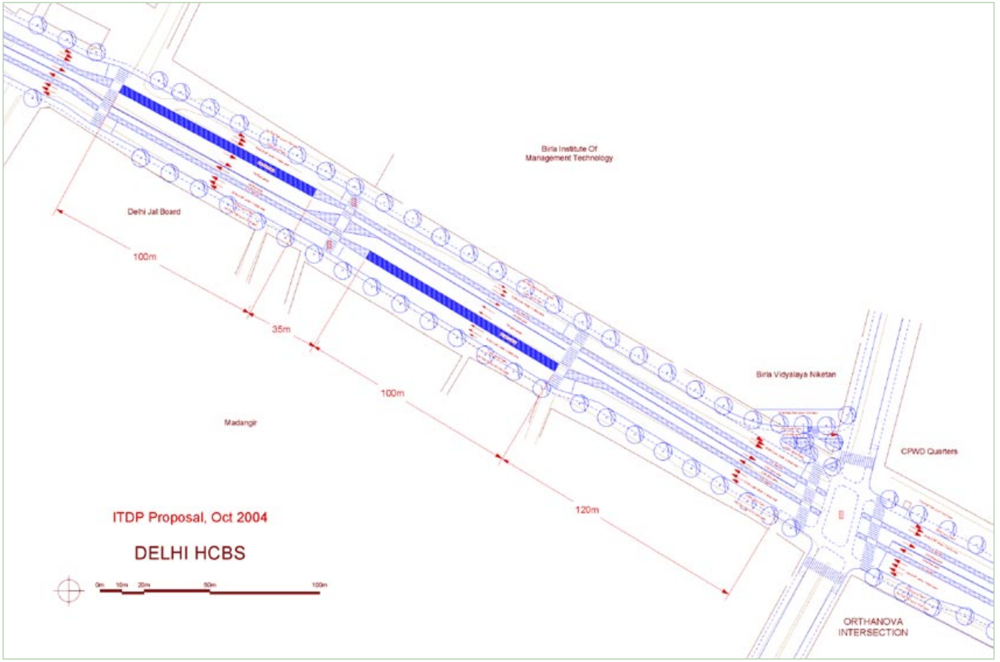
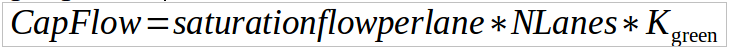
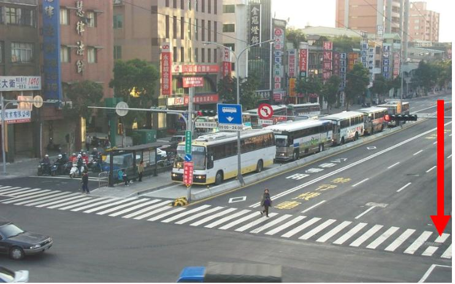

#[Intersections and traffic signals](toc.md#toc)

## Station location relative to the intersection

**"The engineer's first problem in any design situation is to discover what the problem really is."** - Anonymous

Intersection and station design should minimize the added travel time of the all the customers. The station location in relation to the intersection will affect BRT system flow and speed  and the right-of-way needed for the BRT system. Pedestrian travel times, which seems to be the more obvious reason for determining station location are far less relevant than it appears at first.

Because conditions vary from intersection to intersection, it is generally advisable to find an optimal solution for each intersection rather than to presume a single solution will always be optimal. The greater amount of information the planning team has available regarding demand, the easier it will be to evaluate alternatives, finding an optimal solution under the existing restrictions.

### Station location possibilities

The following station locations are possible: 

- At the intersection:
    
    - For side aligned stations, station can be either nearside or far side, i.e. before or after the intersection in each direction;
    - For median stations, if not split, station will be near side in one direction and far side in the other;

- Away from the intersection;
    
    - near the intersection;
    - far from the intersection (or mid-block);

- Under or over the intersection.

###### At intersection

The normal justification for putting the bus stop at the intersection is that it reduces walking times for passengers with destinations or transferring on the crossing street. 

Unless the red time is really short (bellow 20 seconds) and station saturation (discussed on Chapter 7) is really low, the resulting saturation of the conjunct intersection + station (i.e. the proportion of time a BRT vehicle will occupy the area with two functions: queue-box waiting for green light and boarding area) will be greater than one and lead to congestion that will end only after the peak (figure \numfig SaoPaulo-spillback). Such a situation clearly will not be compensated by reducing passengers walking times, not even to passengers that will alight on that station and certainly not to all passengers that must only cross that intersection. 

Additionally, such justification is often based in presumptions and rarely based on data, only micro-level destination maps based on surveys can effectively quantify walking time benefits of station location relative to the intersection. Furthermore, large number of transferring passengers should be addressed when route service planning is designed.

In the rare case the station must be located at the intersection, there is an emerging consensus that before the intersection location is preferable, in split platform configurations, if the BRT lane is near the median.

###### Away from the intersection

**Stations should in general be around one hundred meters from intersections.** 

As highlighted above and as discussed in the remainder of this section, there should be some space between the intersection and the station as it:
- provides the possibility of take away mixed-traffic space without change road capacity for the section
- prevents that bus queues at the intersection from hindering the station
- leave width at the intersection for increase mixed-traffic capacity and turns (figure \fignum(guangzhou-single-to-double)).

We further divide the possibility of location in relation to the intersection in "near it" and "far from it" (or "mid-block"). The aspect to be taken into consideration for this dichotomy is the passenger access to the station.

Mid-block-stations will require access infrastructure not shared nor closely related with the intersection pedestrian crossings. In the typical environment discussed here,i.e., a station located between mixed-traffic signalized intersections, signalized at-grade options is the likely ideal solution. But such solution introduces a new intersection (considering the multimodal definition of it) that needs to be taken into account when evaluating capacity both of the station and of mixes traffic.

We should remember that a crossing for access will be required to curb-side mid-block stations as well. Mid-block stations access are arguably safer than near-intersection stations and cycle times can be shorter. Saturation correction must be applied (see \sectionnumber(Correction factor for station saturation at traffic-light))

###### Above or bellow the intersection

This alternative is discussed at the section \sectionnumber(Grade Separation), where other aspects of graded-separated solutions are presented.

### Minimum mixed-traffic number of lanes away from the intersection that does not affect segment capacity

Usually the mixed-traffic bottleneck is the intersection, where capacity is fifty to thirty percent  (proportional to the green fraction of each approach) of mid-block capacity. So if BRT stations are far from intersections, the general-traffic road capacity can be reduced in its surroundings without any significant impact on the capacity and performance on the segment as a whole. This means that mixed-traffic lanes can be removed, and  its space given to the BRT station,  thus enabling the widening  required for BRT at stations to accommodate passing lanes, and hence provide high capacity at stations without impacting mixed-traffic capacity at all (Figure Seoul-wide-station).

For example, at the bus stop, if bus frequencies are high and an overtaking lane is needed at each station, the extra width required will be around 12 metres.  If the station is located at the intersection, these 12 metres will be difficult to supply while also providing 6 metres turn lanes for mixed traffic.  Separating these functions will allow the same right of way to be used for the bus station at mid-block, and for left and right turn signals at the intersection. Figure Delhi-station-layout shows an application of this concept within a proposal for the Delhi BRT system. 

Once capacity in a given control section (CapFlow) is expressed by:

where:
CapFlow:Capacity of the evaluated section of control, usually in pcu/hour;
flowperlane_saturation: saturation flow of one lane (in "ideal conditions", around 1800 in urban areas pcu/hour);
K_green: : relative (effective) green time, K_green=Time_green / Time_cycle;
NLanes: total  number of available lanes;

One can evaluate the possibility of narrowing mixed-traffic road away from intersection without affect the capacity of the segment, by assuring that capacity away from intersection (where relative green time can be considered 1 or 100%) is greater than capacity in the intersection; 

FlowCap_away >= FlowCap_intersection

saturationflowperlane * NLanes_away * K_green-away >= saturationflowperlane * NLanes_intersection * K_green-away

NLanes_away >=  NLanes_intersection * K_green-intersection / K_green-away

Examples:

- if near intersection mixed traffic has 3 lanes (NLanes_away = 3), and relative green time is 60% (Time_green/ Time_cycle = 0.6), then far from intersection (Nlanes_away) can be 2 lanes without affecting the segment performance: NLanes_away >=  3 * 0.6 = 1.8

- if near intersection mixed traffic has 2 lanes (NLanes_away=2), and relative green time is 50% (Time_green/ Time_cycle = 0.6), then far from intersection (Nlanes_away) can be only one lane without affecting the segment performace:xNLanes_away >=  2 * 0.5 = 1.0

- If we are planning a mid-block station with signalized crossing for the first example, we would have to keep relative green for traffic mid-block above 90 percent:

NLanes_away >= NLanes_intersection * K_green-intersection /

### Minimum Recommended Distance between the BRT Station and the Intersection from mixed-traffic perspective

NOTICE: THIS DISTANCE IS FOR THE DESIGN OF STATIONS THAT TAKES AWAY MIXED-TRAFFIC LANES, NARROWING THE AVAILABLE SPACE FOR CARS AWAY FROM THE INTERSECTION ASSURING THAT MIXED-TRAFFIC CAPACITY DOES NOT GET AFFECTED!

Away from the signalized intersection means far enough to guarantee that the capacity flow in the intersection can last all the green phase. This is equivalent to assure that the queueing space  with the same number of lanes of the intersection approach has enough capacity to hold all vehicles that can cross the intersection in the duration of the green phase.

This means the distance from intersection (Dist_station-intersection) has to be longer than the space between to queueing vehicles times the number of vehicles that will cross the retention line in one lane.

Considering that a saturation flow per lane (saturationflowperlane) of 1800 pcu/hour is equivalent to one vehicle each two seconds (across the intersection in one lane) and the distance between (the front of) two vehicles (length_pcu) is 5 meters, this means that for each second of the green phase the queue will be 2.5 meters short.

Queue discharge rate = flow_saturation/lenght_pcu

Another way to think about this is that the “speed of the shock-wave” starting at the retention line after the traffic-signal opens is 2.5 metres per second, i.e., the second car behind (5 meters behind) will start to move 2 seconds after the first, the third car behind (10 meters from the retention line) will move after 4 seconds and so on...

Velocity_discharge-shock-wave = flow_saturation/lenght_pcu

Therefore the distance between station and intersection (Dist_station-intersection) has to be equal or greater than the distance the shock-wave can move during the duration green phase (T-gree); representing the speed of shock-wave by Vel_shock-wave, this can be expressed as:

Dist_station-intersection >= V_shock-wave * Time_green

Using meters and seconds for the measures we have:

Dist_station-intersection[in metres] >= 2.5 * Time_green[in seconds]

Examples:

If green time is 40 seconds, the station must be at least 100 meters from the intersection, equal the length of queue discharged during the green time 

Dist_station-intersection[in metres] >= 2.5 * 40 = 100

If green time is 90 seconds, the station must be at least 225 meters from the intersection, equal the length of queue discharged during the green time 

Dist_station-intersection[in metres] >= 2.5 * 90 = 225

. Diagram courtesy of ITDP.") 

### Minimum Recommended Distance between the BRT Station and the Intersection from BRT perspective

Another compelling reason for separating the station location and the intersection is that it minimizes the risk that BRT vehicles will be backed up at the station, which will inhibit the functioning of the intersection and the functioning of the station. If these two potential bottlenecks are co-located, the risk of mutual interference between the station and the intersection increases. Consequently, it is advised to include a safety buffer in the station design for those stations to be located near a signalized intersection. This additional length will temporarily hold buses that: (1) in case of a blockage have cleared the station but are forced to queue up at the intersection until the conflict is resolved, or (2) have cleared the station during the red phase and have to wait for the green cycle (Figures \fignum station-spillback and \fignum intersection-spillback).This buffer should also be around one hundred meters, as the following equations show.

This problem is still serious in “open” BRT systems without clearly designated stopping bays, as bus queueing can be longer than the platform. Besides that, such systems chaotic boarding process not only creates stress for the customer but it also increases boarding times (Figure \fignum Taipei-spillback).

The buffer size (Dist_station-intersection) should be the space required by queuing BRT vehicles. 

Dist_station-intersection >= N_bus * Length_bus

where:

Length_bus: Average length of lane space consumed by the queuing BRT vehicles; adding two values:
 - Length of the BRT vehicle and 
 - Length of space between BRT vehicles when stopped (usually assumed to be 1 metre)

N_bus: Likely number to queue during the red phase (T_red) of traffic signal, discussed bellow.

Assuming BRT vehicle frequencies (Freq_bus) are bellow 50% from the BRT lane saturation flow (SaturationFlow_bus) -- that is practically always, as this represents 360 articulated buses per hour, that would carry more than 40 thousand passengers per hour per direction -- N_bus, which is equivalent to the height of the upper graphic in figure \fignum traffic-lights-diagram, can be determined by

N_bus = T_red * Freq_bus / (1 - Freq_Bus / SaturationFlow_bus) 

Example utilising typical data of an average city in India:

T_red = 50 seconds (or 50/3600 hours to use consistent units = 1/72 hour);
Freq_bus = 200 articulated-buses /  hour (equivalent to 1 bus each 18 seconds);
SaturationFlow_bus = 720 articulated buses / hour (one lane, equivalent to 1 bus each 5 seconds)
Length_bus = 19.5 metres (18.5 metres  + 1 metre)

N_bus = 50/3600 * 200 / (1 – ( 200/720 )) = 3.8 buses

Because one cannot actually operate 3.8 buses, N_bus must be rounded to the nearest integer, so it is equal to 4.

Dist_station-intersection >= N_bus * Length_bus
Dist_station-intersection >= 4 * 19.5
Dist_station-intersection >= 78 metres

Thus, the minimum recommended distanced between the BRT station and the intersection would be 78 meters.

BRT systems currently in operation prove that  mixed traffic misbehaviour are a relevant source of operation disruptions throughout the public transport system. Traffic spillbacks are commonly seen in heavily congested intersections blocking perpendicular movements along the BRT corridor, so it may be proper to analyse the tolerance, space needed is proportional to red time. 

### Optimising walking distances

As mentioned in the introduction to this section, the willingness to place a station close to the intersection under the excuse to to reduce walking times is rarely based on data. In the rare cases of low density areas with few clear origin-destinations where de demand is known, the optimal spot can be easily determined. Such locations are not likely to have a busy intersection to deal with, and in the event that they do and that is clearly the best location from the walking time reduction perspective, it is more likely that is better to move the station the length of a few buses back than risk hindering the station. That can be perceived considering only the passenger that intends to alight in that location: he may need an extra minute to walk to the intersection and he would need an extra minute inside the bus stuck before the station because the bus in front is waiting for the signal green. If we consider all the other passengers not alighting there will increase their travel time by one minute and that the queue is likely to get longer (and everyone will wait more than one minute) it is clear that the station should be moved away from the intersection.

The previous paragraph made clear, in high density areas to optimise station location with high precision requires labour intensive, site-specific survey and analysis of the origins and destinations, taking into consideration a pedestrian path network encompassing an area within radius of 1,000 metres or more from the possible extremes where the station can be placed, as well as several different street crossings as well as the placement of other stations. That is detailing the simulation model to the level that every block face is a centroid, if not every address. 

Our limited experience on such endeavors on central areas has shown that moving a station within a range of two hundred metres has no noticeable effect. But It should be remembered that **changing the number of stations within a given corridor extension have significant impact on overall travel time**; that is equivalent to determine the average distance between the stations as discussed in Chapter 7 and requires a much lesser detailed survey and analysis.

### Correction factor for station saturation at traffic-light

Chapter 7 discussed at length the **level of saturation of the station, the proportion of time that BRT vehicles are blocking the station**, mid-block-stations in special are likely to be access by at-grade crossings right in front of it. It is generally advisable to investigate the degree to which this intersection increases the saturation of the station.

Roughly, the combination of the station’s normal saturation (to which we will refer as X_station) and the additional saturation caused by traffic signal interference will tell one the degree of busway saturation.  As a general rule, it is best to design the station with a saturation level of under 0.4 at the station, meaning that the station is only occupied 40 percent of the time.

A correction factor that estimates what would be the new level of saturation of the station if the traffic light is positioned right in front of it (X_is0) can be expressed in function of:
- Signal cycle time (T_cycle);
- Signal red time for the BRT approach (T_red);
- Average stop time per bus in the station composed by dwell, boarding and alighting times (T_station)

###### Correction for a long red phase (T_station < T_red)

Where the relation between T_red and T_station is the most important.The concern about interference is most acute when the bus stopping time (TB) is short and the red phase (TR) is longer, or of similar magnitude.  Interference is only of limited concern if the red phase is very short.

In this case, calculating the saturation of the station when faced with interference from the traffic signal, the following formula can be used:  

)}")

###### Correction with a short red phase (T_station >= T_red)

If the red signal phase is very short relative to the boarding and alighting time, then even if the signal changes to red just as boarding and alighting has been completed, it will be a short time before the light is green again.  Thus, there is less concern about interference between the station and the intersection. 

}") 

###### Examples

**1.Calculating station to intersection interference with a long red phase**

X_is0 = X_station * {T_cycle} over {( T_cycle - T_red + (0.5 * TB))}

X_station = 0.35
T_cycle = 700 seconds 
T_red = 500 seconds 
T_station = 10 seconds

X_is0 = 0.35 * 700 seconds / ( 700 seconds – 500 seconds + 0.5 * 10 seconds )
      = 1.195	

In this hypothetical example the station would operate on just the 200 seconds of green, but not on the 500 seconds of red, because just some seconds after the red phase begins the bus will finish boarding, but it will obstruct access to the bus stop during the entire 500 seconds of red. Thus, at a value of 1.195 the high saturation leads to considerable congestion of the busway.

**2.Calculating station to intersection interference with a short red phase**

X_is0 = X_station * {T_cycle} over {( {T_cycle - T_red ^ 2} over { 2 * T_station})}

TR = 15 seconds of red phase
TB = 40 seconds of vehicle stopping time
TC = 30 seconds full signal phase
x = .35 

X_is0 = .35 * 30 / ( 30 - 152 / ( 2 * 40 ) )
       = 0.386

In this case, because the red phase is quite short, there is fairly minimal risk that the traffic signal will disrupt the functioning of the bus stop, so saturation increases only marginally, from 0.35 to 0.386. 

